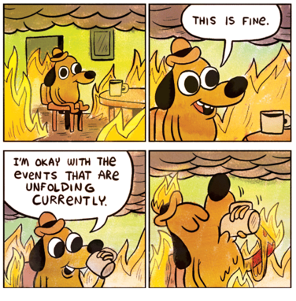

## Troubleshooting

---

You should have no problem installing R and RStudio, just make sure you have the correct versions for both (3.4.4 for R, 1.1.447 for RStudio).  There's a wealth of info online that should point you in the right direction if you do have problems installing these items.

In theory, all of the packages should install without a hitch but you may encounter a few hiccups.  This will usually be accompanied with a scary red error message shown in the console.  The best way to troubleshoot the installation is to read the error message to try to understand what R wants. It might just need you to manually install another package first.  Google is also a helpful tool for troubleshooting installation.  Here are some suggestions for troubleshooting package installs:

* Read the error message to try to figure out the problem
* If the error message is cryptic, try Googling to find a solution
* It never hurts to restart R if an installation fails, use `Ctrl + Shift + F10` in Windows or `Cmd + Shift + F10` on a mac.
* Some packages might require you to install RTools to compile the package from source.  RStudio will try to install it for you.  If that doesn't work, follow [these instructions](http://jtleek.com/modules/01_DataScientistToolbox/02_10_rtools/#1).

We will also be available before the workshoot to troubleshoot any last minute issues but please make all efforts beforehand to fix the problems yourself because we'll have limited time.  You can always email us with questions (see our emails on the [home page](https://ryan-hill.github.io/sfs-r-gis-2018/)).
