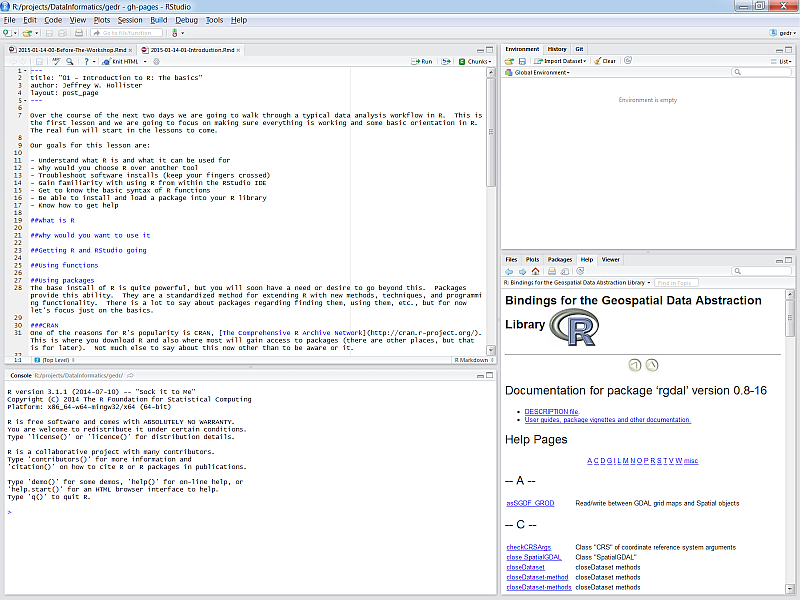
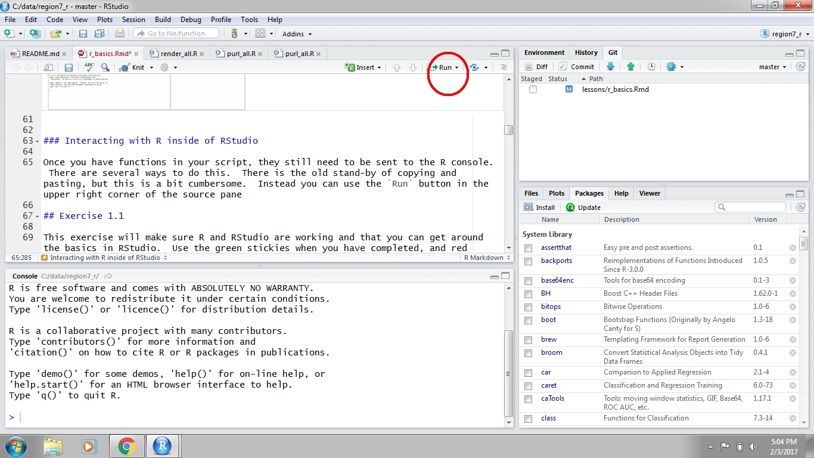

## Goals and Motivation

---

[R](https://www.r-project.org/) is a language for statistical computing as well as a general purpose programming language. Increasingly, it has become one of the primary languages used in data science and for data analysis across many of the natural sciences. 

We have a limited amount time in this workshop. As such, the goals of this training are to expose you to spatial data fundamentals in R and to develop an appreciation of what's possible with this software.  We also want to provide resources that you can use for follow-up learning on your own. 

We will use this first lesson to show you how to setup an RStudio project with an RMarkdown file that we'll use for the rest of the worshop.  Specifically, you should be able to answer these questions at the end of this session:

* Why would I use RStudio and RStudio projects?
* How can I setup an RStudio project?
* How can I write, save, and run scripts in RStudio?
* What is RMarkdown and how does it differ from a regular script?  

## RStudio

In the old days, the only way to use R was directly from the Console - this is a bare bones way of running R only with direct input of commands. Now, RStudio is the go-to Interactive Development Environment (IDE) for R. Think of it like a car that is built around an engine. It is integrated with the console and includes many other features such as version control, debugging, dynamic documents, package manager and creation, and code highlighting and completion. 

Let's get familiar with RStudio before we go on.  

### Open R and RStudio

Find the RStudio shortcut and fire it up (just watch for now).  You should see something like this: 

There are four panes in RStudio: 

* Source
* console
* Environment, History, etc.
* Files, plots, etc.

### RStudio projects

I strongly encourage you to use RStudio projects when you are working with R.  The RStudio project provides a central location for working on a particular task.  It helps with file management and is portable if all the files live in the same file tree.  RStudio projects also remember history - what commands you used and what data objects are in your enviornment.  

Here are the most important reasons to use RStudio projects:

* Relative file paths (no messing with `setwd()`)
* Centralized location for data, scripts, and content
* Shareable, reproducible, and transparent

To create a new project, click on the File menu at the top and select 'New project...'

It's ofen hard to determine the scope of a project. When should a new project be created? Should one project be used for a dissertation?  Probably not.  What about one project for manipulating one data file?  Probably not.  To help you determine the scope of each project, think about these questions:

* What is the purpose of using R right now?  
* Am I manipulating multiple files?
* Are all these files linked by a common theme (e.g., abundance data, environmental data)
* If I shared this with someone, would they have all the necessary data?

We'll use one project for this workshop that we'll create in the first exercise.

### Scripting

In most cases, you will not enter and execute code directly in the console.  Code can be created in a script and then sent directly to the console when you're ready to run it.  The key difference here is that a script can be saved and shared.

Open a new script from the File menu...

### Executing code in RStudio

After you write your script it can be sent to the Console to run the code in R.  Any variables you create in your script will not be available in your working environment until this is done.  There are two ways to sent code the console.  First, you can hit the `Run` button at the top right of the scripting window.  Second, and preferred, you can use `ctrl+enter`.  Both approaches will send the selected line to the console, then move to the next line.  You can also highlight and send an entire block of code.

### What is the environment?

There are two outcomes when you run code.  First, the code will simply print output directly in the console.  Second, there is no output because you have stored it as a variable (we'll talk about variable assignment later).  Output that is stored is actually saved in the `environment`.  The environment is the collection of named objects that are stored in memory for your current R session.  Anything stored in memory will be accessible by its name without running the original script that was used to create it.  

## Exercise

We'll create an RStudio project in this exercise that we'll continue to use for the rest of the workshop. Use the blue stickies when you have completed, and red stickies if you are running into problems.

1. Start RStudio: To start both R and RStudio requires only firing up RStudio.  RStudio should be available from All Programs at the Start Menu.  Fire up RStudio. 

1. Take a few minutes to look around RStudio.  Find the Console Pane. Find Global and Project Options (hint: look in Tools).  Look at the Environment, History Pane.  Look at the Files, Plots, Packages, etc. pane.

1. Create a new project from the File menu. Select the option for a new directory. Find a suitable location on your computer and name the folder "sfs_spatialr_workshop".  We will use this for the rest of the workshop.

1. In the bottom-right corner of RStudio, click Files > New Folder. Name the folder 'data' and click 'Ok'. Unzip the workshop data that you downloaded to this folder.

