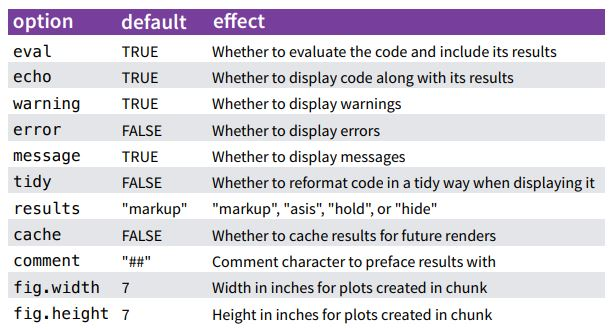

```{r echo = F}
knitr::opts_chunk$set(fig.path = '../../../img')
```

### What is R Markdown?

During the workshop, we will be using R Markdown within RStudio. Markdown is an easy way to format text that can be translated into an HTML file (or other format). RStudio added the additional feature that you can run R code within the markdown document to integrate your descriptions of the analysis, R code, and R output into a single HTML. You can think of this type of documentation as **adding code to your comments rather than comments to your code.**

R Markdown documents can be easily shared with others or submitted with manuscripts as an appendix ([example](https://esajournals.onlinelibrary.wiley.com/action/downloadSupplement?doi=10.1002%2Feap.1617&attachmentId=2187835387)) to provide open and transparent methods. Here, we'll walk through an example of how to make an R Markdown document. It will become more apparent why we are learning about R Markdown when we make maps.

### Creating an R Markdown document

RStudio provides a template for creating an R Markdown file: 

* File > New File > R Markdown
* Add title
* Add author
* Select HTML

### R Markdown basics

Your template should look like this: 

````
---
title: "Untitled"
output: html_document
---

```{r setup, include=FALSE}`r ''`
knitr::opts_chunk$set(echo = TRUE)
```

## R Markdown

This is an R Markdown document. Markdown is a simple formatting syntax for authoring HTML, PDF, and MS Word documents. For more details on using R Markdown see <http://rmarkdown.rstudio.com>.

When you click the **Knit** button a document will be generated that includes both content as well as the output of any embedded R code chunks within the document. You can embed an R code chunk like this:

```{r cars}`r ''`
summary(cars)
```

## Including Plots

You can also embed plots, for example:

```{r pressure, echo=FALSE}`r ''`
plot(pressure)
```

Note that the `echo = FALSE` parameter was added to the code chunk to prevent printing of the R code that generated the plot.
````

There are three basic elements in any R Markdown document:

1. The __YAML header__ at the top that defines the output type
1. The __code chunks__ for R code
1. Text __content__ in between the code chunks that can be modified with Markdown

The magic happens when you "knit" the document using the knit button at the top (or alternatively using the function `rmarkdown::knit('myfile.Rmd')`).  This commands accomplishes two separate tasks:

1. Execution of R code in R chunks to create a Markdown File
1. Conversion of the Markdown file to rendered text, such as an HTML file

Effective use of an RMarkdown file generally requires basic understanding of markdown syntax and how the options for the code chunks are changed. 

### Text formatting with markdown

Text that is not included in the __YAML header__ or a __code chunk__ can be stylized with Markdown.  Using markdown to stylize is not a requirement to create an R Markdown document but it certainly helps to differentiate parts of the text, such as headers, bold, italic, or lists.  

The R Markdown cheat sheet available from the file menu in RStudio (Help > Cheatsheets) will show you most of these options.  Here are some common examples:

<pre>
# Header 1
## Header 2
### Header 3

*italic*
**bold**
  
* unordered list
* item 2
* item 3

1. ordered list
1. item 2
1. item 3
</pre>

### Basics of code chunks

Code chunks in an R Markdown document will include code that is executed when the document is compiled.  It's best to think about all of the individual code chunks in a document as a continuous script.  All code chunks are run in sequence from first to last for everything to work properly when the document is compiled.  You can run the code chunks all at once without compiling the document or individually if you want to inspect the output of an individual chunk.  Just remember that a code chunk may not work properly by itself if it depends on information from another code chunk that hasn't already been run.  

The easiest way to include a new code chunk in your R Markdown file is to use the shortcut keys: `Cmd/Ctrl + Alt + I`.  Alternatively, you can just type the code chunks or ust the insert button at the top of the script window, but the shortcut is much faster.  Once the code chunk is added, all R code can then be entered between the delimiters. 

How the code is executed and how the output is formatted can be controlled using the options for each code chunk.  There are several options that are all worth considering (see [http://yihui.name/knitr/](http://yihui.name/knitr/)), but there are only a handful that you will use repeatedly (from the cheatsheet):

```{r, out.width = '65%', echo = F}

```

The options are included within the braces after the first comma. It will look something like this in your R Markdown document:

```{r, results = 'asis', echo = F}
cat("<pre>```{r, results = 'hide'}\n1 + 1\n```</pre>")
```

The above example will run the code chunk, but the results are not included in the compiled document (i.e., `2` is not printed in the output).  This example will include the results in the document but the code chunk is not included. 
```{r, results = 'asis', echo = F}
cat("<pre>```{r, echo = F}\n1 + 1\n```</pre>")
```

This example will not run the code in the code chunk, but the chunk is included in the compiled document.
```{r, results = 'asis', echo = F}
cat("<pre>```{r, eval = F}\n1 + 1\n```</pre>")
```

You can also include a name for the code chunk after the `r` but before the first comma.  This can help navigate between code chunks. 
```{r, results = 'asis', echo = F}
cat("<pre>```{r mychunk, eval = F}\n1 + 1\n```</pre>")
```

Figures and tables can be included and formatted within code chunks as well.  Most of the formatting for a figure can be done within a code chunk as you would normally when creating a plot.  There are three main code chunk options that define the dimensions of the figure in the compiled R Markdown file: `fig.width`, `fig.height`, and `out.width`.  The first two options define the actual dimensions (in inches) of the saved figure when the document is compiled.  The figures are saved in your project using the name of the code chunk.  The third option defines the width of the figure as displayed in the document.

```{r, results = 'asis', echo = F}
cat("<pre>```{r plotex, fig.height = 4, fig.width = 7, out.width = '75%'}\nhist(rnorm(100))\n```</pre>")
```
```{r plotex, fig.height = 4, fig.width = 7, echo = F}
hist(rnorm(100))
```

Tables can also be displayed in R Markdown documents. The `knitr` package that is used to convert R Markdown to Markdown includes the `kable` function to convert data frames or matrices to an HTML format.

```{r, results = 'asis', echo = F}
cat("<pre>```{r mytable}\ndata(iris)\nknitr::kable(iris[1:5,])\n```</pre>")
```
```{r, echo = F}
data(iris)
knitr::kable(iris[1:5, ], format = 'markdown')
```

### Exercise 

Now that we have an idea what R Markdown is and how to use it, we're going to create a template that we'll use for rest the workshop. We'll open a template from the file menu, setup some code chunks to import our datasets, run some exploratory code, and compile the document. 

1. In your RStudio project that you created in the last exercise, open a new R Markdown template from the File menu (File > New File > R Markdown).  Give the file a title like "SFS R Spatial workshop", enter your name as the author, and select HTML as the output.

1. Remove all of the pre-filled code chunks and text below the YAML header.  Add some new text below the header explaining the purpose of this file, e.g., "This R Markdown document was created for the SFS R Spatial workshop.  It includes both text and code to demonstrate all of the cool stuff I learnred."

1. Below your new text, create a code chunk using the keyboard shortcut (Ctrl/Cmd + Alt + I). Name the code chunk `setup` within the braces.  Don't forget to include a space between `r` and `setup`.  After the name, include the following code chunk option: `warning = F` and `message = F`.

1. In the code chunk, enter some code to import the libraries we'll be using for our exercises (e.g., `library(sf)`).  We'll be using the following libraries: `sf`, `raster`, `maptools`, `rgeos`, `rgdal`, and `mapview`.  You'll need to install these libraries if you don't have them already (e.g., `install. packages('sf')`).

1. In the same code chunk and below the library commands, enter the following code to import our example data. 

1. When you're done, save the new file in the root directory of your project.  This should be the default directory when you select File > Save As from the menu.  Give the file a short name, e.g., `workshop.Rmd`.  

1. Hit the knit button at the top of the script window in RStudio.  This should compile the R Markdown file to HTML. Did it work and does everything look ok?


