# Basic Mapping

<script src="../../../js/hideoutput.js"></script>


### Goals and Motivation

Now that we've covered vectors and rasters in R, it's time to discuss how we can make some nice plots and maps of these data.  The distributed network of R packages has continued to grow over the years and now offers many easy options for mapping.  In addition, base R graphics and those provided by the powerful [ggplot2](http://ggplot2.tidyverse.org/) package can also be used to plot spatial data.  We'll discuss how we can leverage generic plotting functions in R and more specific packages to help us explore spatial data in more detail. 

By the end of this lesson, you should be able to answer these questions:

* How can I use base graphics to create simple maps?
* How can I use ggplot2 to create simple maps?
* How and when would I use plotly?
* How and when would I use mapview?
* How and when would I use micromap?
* How and when would I use tmap?

### Exercise

Let's first make sure we have an R Markdown file setup and the correct packages loaded.

1) In the project you created for this workshop, open a fresh R Markdown file from the File menu.  Name it "Basic mapping" and save it in your project.

2) Remove all the template content below the YAML header.  Add some descriptive text using Markdown below the YAML header that briefly describes the lesson plan (e.g., "This lessons covers base graphics, ggplot, and other R packages for mapping spatial data.")

3) Below this text, add a code chunk and write some script to load the following packages: `ggplot2`, `maps`, `sf`, `ggmap`, `ggrepel`, `plotly`, `mapview`, `micromap`, `tmap`. It should look like this inside your code chunk:

```r
library(maps)
library(sf)
library(raster)
library(tmap)
library(micromap)
library(ggrepel)
library(ggmap)
```

4) When you're done, compile the document by pressing the knit button at the top. Did it work?

<details> 
  <summary>Click here to cheat!</summary>
   <script src="https://gist.github.com/fawda123/e3f1d19471652194e29f519b42b054f8.js"></script>
</details>

### A primer on mapping

Mapping spatial data falls under the broad category of data vizualization.  The same motivation for creating a simple scatterplot can apply to creating a map.  The overall goal is to develop insight into your data by visualizing patterns that cannot be seen in tabular format.  Of course the added complication with spatial data is the inclusion of a location.  How you handle this spatial component is up to you and depends on whether location is relevant for the plot or map.  

Spatial data by definition always include a reference location for each observation.  More often than not, additional variables not related to space may be collected for each observation.  For example, multiple measurements of water quality taken at different locations in a lake can be indexed by latitude, longitude, and whatever water quality data were taken at a sample site.  The only piece of information that makes the water quality data spatial is the location. Whatever your data look like, you have to choose if space is an important variable to consider given your question.  For mapping spatial data, consider the following:

* Do I care about the spatial arrangement of my data?
* Would I expect my non-spatial data to vary by space?  
* Are there other spatial units for aggregating my data that can help understand patterns?

The answer to these questions can help you decide what type of visualization is important for the data.  On the other hand, mapping the data can also give you answers to these questions.  We'll explore different mapping approaches in this lesson that will help us address these questions.

### Basic maps

Let's start by taking the simplest type of spatial data and creating the simplest type of map.  We'll use the same dataset when we first started the workshop.  


```r
cities <- c('Ashland', 'Corvallis', 'Bend', 'Portland', 'Newport')
longitude <- c(-122.699, -123.275, -121.313, -122.670, -124.054)
latitude <- c(42.189, 44.57, 44.061, 45.523, 44.652)
population <- c(20062, 50297, 61362, 537557, 9603)
dat <- data.frame(cities, longitude, latitude, population)
plot(latitude ~ longitude, data = dat)
```

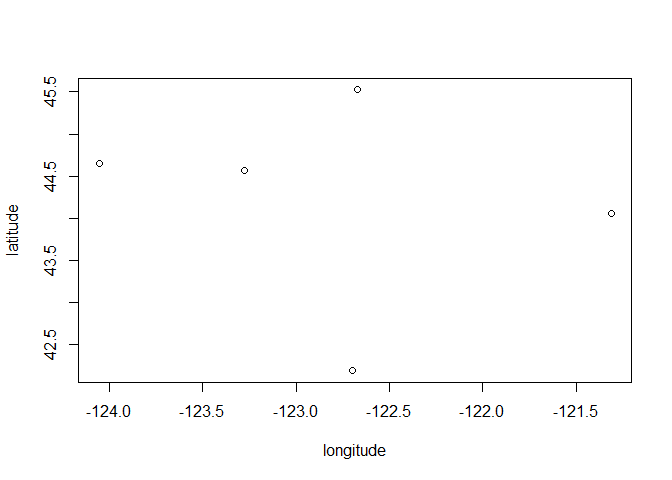<!-- -->

Neat, we've created a map in cartesian space.  As we've learned, we need to convert our data into a spatial object with the correct coordinate system.  This will let us correctly view the georeferenced data.  Let's convert our data frame to an `sf` object.


```r
dat_sf <- st_as_sf(dat, coords = c("longitude", "latitude"))
st_crs(dat_sf) <- "+proj=longlat +ellps=WGS84 +datum=WGS84 +no_defs"
head(dat_sf)
```

```
## Simple feature collection with 5 features and 2 fields
## geometry type:  POINT
## dimension:      XY
## bbox:           xmin: -124.054 ymin: 42.189 xmax: -121.313 ymax: 45.523
## epsg (SRID):    4326
## proj4string:    +proj=longlat +datum=WGS84 +no_defs
##      cities population                geometry
## 1   Ashland      20062 POINT (-122.699 42.189)
## 2 Corvallis      50297  POINT (-123.275 44.57)
## 3      Bend      61362 POINT (-121.313 44.061)
## 4  Portland     537557  POINT (-122.67 45.523)
## 5   Newport       9603 POINT (-124.054 44.652)
```

Now we can just plot the locations of our `sf` object by telling R to only plot the geometry attribute.

```r
plot(st_geometry(dat_sf))
```

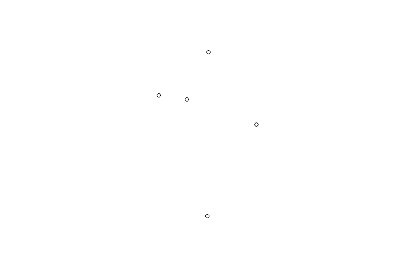<!-- -->

Although it's a bland plot, the points are now georeferenced.  We can use some base maps from the `maps` package to add some context for the locations (note the `add = T` argument). 

```r
map('county', region = 'oregon')
plot(st_geometry(dat_sf), add = T)
```

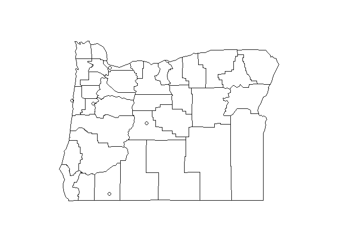<!-- -->

There really isn't anything too interesting about the locations of these cities, so maybe we want to overlay an additional attribute from our dataset.  Remember that we have the population of each city as well.  We can change the point types and scale the size accordingly.

```r
map('county', region = 'oregon')
plot(st_geometry(dat_sf), add = T, pch = 16, cex = sqrt(dat_sf$population * 0.0002))
```

<!-- -->

This is kind of tedious.  We can alternatively make the same plot using ggplot2 to map some of the data attributes to the plot aesthetics.  We'll take advantage of the `geom_sf` function to plot the `sf` object.  

First, we have to have all of our map objects in the correct format for `sf`.  Our cities dataset is already an `sf` object, so all we have to do is convert our base state map to an `sf` object.


```r
state <- st_as_sf(map('county', region = 'oregon', plot = F, fill = T))
```

 __Before we proceed, we need to make sure we have the develoment version of ggplot2.__ This version includes the `geom_sf` function, which is included with the stable release on CRAN.  Run the following code if you haven't done this already.  The devtools package is needed to install development packages from GitHub.


```r
install.packages("devtools")
library(devtools)
install_github("ggplot2")
library(ggplot2)
```

Now we make the plot with the `geom_sf` function from ggplot2 for both `sf` objects. 


```r
ggplot() +
  geom_sf(data = state) +
  geom_sf(data = dat_sf)
```

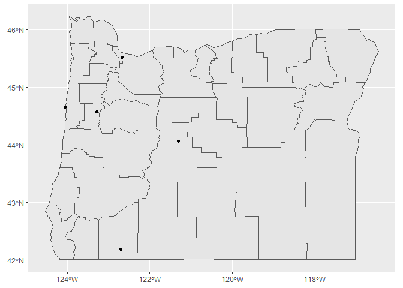<!-- -->

We can also map population to size and colour.

```r
ggplot(dat_sf) +
  geom_sf(data = state) +
  geom_sf(aes(size = population, colour = population))
```

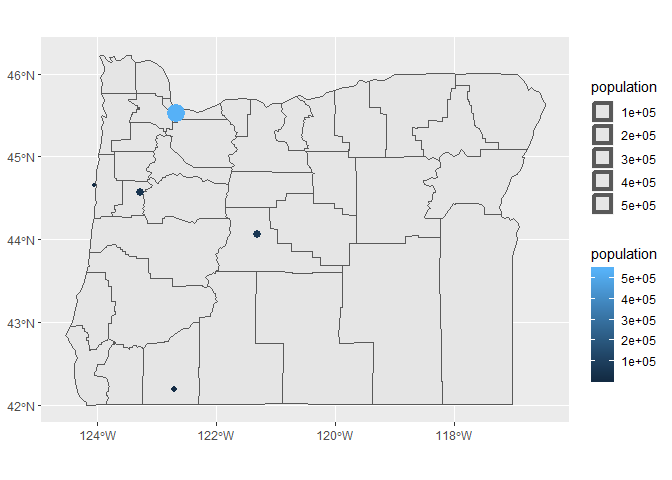<!-- -->

There are a few things we might want to modify with this plot, so let's assign it to a variable in our workspace that we can easily modify (using the handy `last_plot()` function from ggplot2).

```r
p <- last_plot()
```

Now let's make the size gradients more noticeable, remove the weird size legend, and change the color ramp.

```r
p <- p +
  scale_size(range = c(5, 15), guide = F) + 
  scale_colour_distiller(type = 'div', palette = 9)
p
```

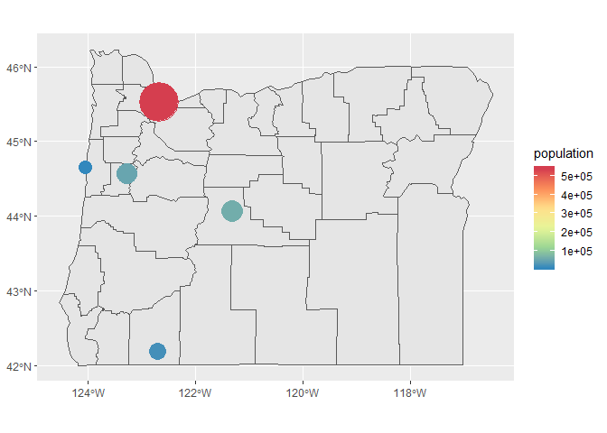<!-- -->

We can also add labels using `geom_text`.  Let's plot the city names over the points.

```r
p + geom_text(aes(x = longitude, y = latitude, label = cities))
```

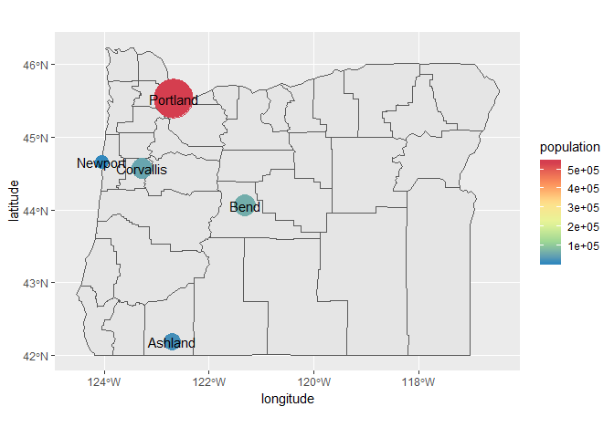<!-- -->

If we want to prevent the labels from overlapping the points, we can use the `geom_text_repel` function from the [ggrepel](https://github.com/slowkow/ggrepel) package. You'll have to play around with the values for `point.padding` to get the distances you like. The `segment.alpha` value will also remove the lines joining the points to the labels.

```r
p + geom_text_repel(aes(x = longitude, y = latitude, label = cities), point.padding = grid::unit(0.5, 'lines'), segment.alpha = 0)
```

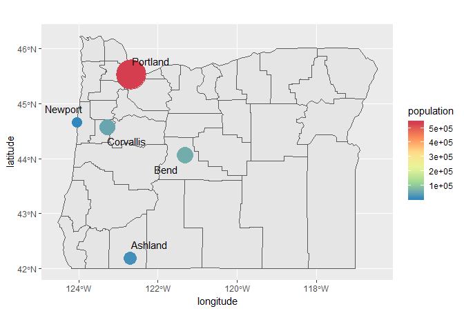<!-- -->

### ggmap

As an alternative basemap, we can leverage the `ggmap` package to download a static image of our plot region.  This often works well for plotting points where the mapping unit of interest is relatively simple (i.e., not a line or polygon).  It's also useful for arbitrary areas of interest that aren't easily captured by the geopolitical boundaries. 

To use `ggmap`, you have to first download the image with the `get_map` function based on the extent of the plotting area.  This requires pulling the extent from our existing data object that we want to plot.  Then, we can choose from different basemaps, such as Google basemaps, terrain maps, and satellite images.  For this example we'll download a satellite image of our area.  One thing to keep in mind is the zoom option.  This is used to specify the level of detail in your downloaded image and can take quite some to download depending on the area and level of specificity.  We'll follow these steps to download the basemap:

* Get the extent from our `dat_sf` object using `st_bbox` and `unname` to remove the name attributes (ggmap will fuss otherwise)
* Download a satellite image using the `get_map` function in the ggmap package with the extent, pick the right `zoom` level and specify `maptype = "satellite"`
* plot the base map with the `ggmap` function


```r
# get the extent
dat_ext <- unname(st_bbox(dat_sf))

# get the base map using the extent
bsmap <-  get_map(location = dat_ext, maptype = 'satellite', zoom = 7)

# plot the basemape
ggmap(bsmap)
```

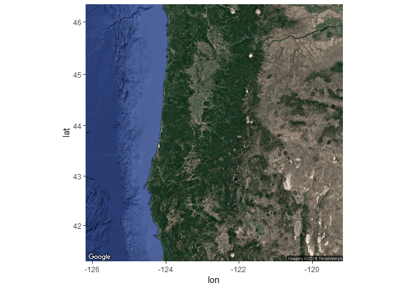<!-- -->

Now that we've got the base map in order, we can simply add the locations of our cities with the `geom_sf` function from the `ggplot2` package as before.  The `ggmap` function returns a `ggplot2` object so we can just add geoms and other ggplot options as we normally would.  We'll have to tell ggplot to ignore the aesthetics from ggmap for the plot to work correctly (`inherit.aes = F`).

```r
ggmap(bsmap) +
  geom_sf(data = dat_sf, inherit.aes = F, color = 'red')
```

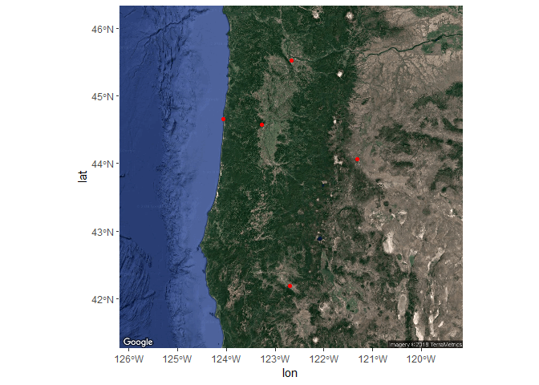<!-- -->

We can also map the same aesthetics in our dataset as before to plot size and colour for city population and create some nice labels for the city name.

```r
ggmap(bsmap) +
  geom_sf(data = dat_sf, inherit.aes = F, aes(size = population, colour= population)) +
  geom_text_repel(data = dat_sf, aes(x = longitude, y = latitude, label = cities), point.padding = grid::unit(0.5, 'lines'), segment.alpha = 0, colour = 'white')
```

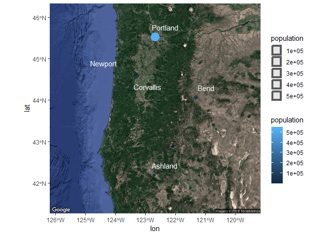<!-- -->

Changing some of the plot options for the aesthetics can also be done as before.

```r
ggmap(bsmap) +
  geom_sf(data = dat_sf, inherit.aes = F, aes(size = population, colour= population)) +
  geom_text_repel(data = dat_sf, aes(x = longitude, y = latitude, label = cities), point.padding = grid::unit(0.5, 'lines'), segment.alpha = 0, colour = 'white') +
  scale_size(range = c(5, 15), guide = F) + 
  scale_colour_distiller(type = 'div', palette = 9)
```

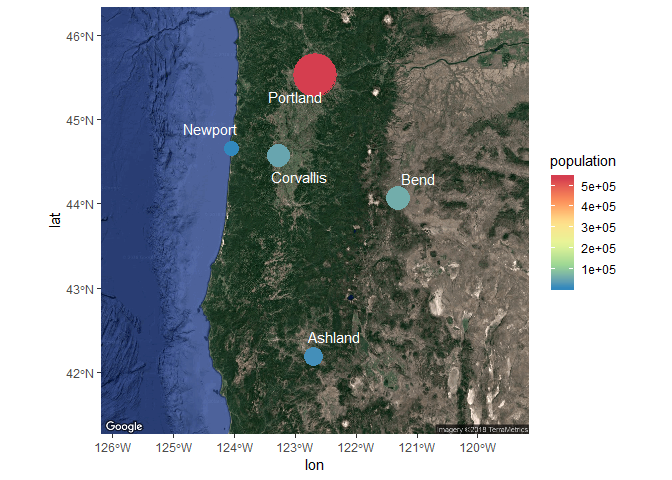<!-- -->

This might seem incredibly tedious but most of the coding has to do with formatting ggplot2. The spatial components are relatively simple and should come naturally if you are already familiar with using R.   

### Exercise

In this exercise we'll recreate the steps we learned in this module but on a different dataset.  The `meuse` dataset comes with the `sp` package and describes the locations and topsoil heavy metal concentrations collected in a flood plain of the river Meuse, Netherlands.  The data are in raw format so you'll have to import and convert it to an `sf` object with the correct reference system. Once we have the object created, you can map it with `geom_sf` and link any of the other dataset variables to additional plot aesthetics.  We'll also want to pick an appropriate basemap for the region using `ggmap`. This is a long exercise so feel free to use the code in the cheat box below.

1. Create a new code chunk in your R markdown file and load the `sp`, `sf`, `maps`, and `gglot2` libraries.

1. Import the meuse dataset from the `sp` package.  Just load the `sp` library as you normally would and run `data(meuse)`. 

1. What is the structure of the data (Hint: `class(meuse)` or `str(meuse)`)? Which columns contain the sample coordinates?  

1. Convert the meuse data frame to an `sf` object using the `st_as_sf` function. The help file tells you what required arguments are needed for converting a data frame with `st_as_sf` (run `?st_as_sf` to open).  Specifically, you'll need to specify the `coords` and `crs` argument (hint: `coords = c("x, y"), crs = "+init=epsg:28992")`.  Don't worry about which coordinate system to use, this info in the help file for meuse (`?meuse`). The conservsion should look something like this: `dat <- st_as_sf(meuse, coords = c('x', 'y'), crs = "+init=epsg:28992")`.

1. The native coordinate system for meuse is projected.  We'll want to convert the `sf` object to a geographic coordinate system as a requirement for `ggmap`.  You can use the `st_transform` and the argument `crs = "+proj=longlat +ellps=WGS84 +datum=WGS84 +no_defs"`.  Don't forget to assign the transformed object to a new variable in your environment (e.g., `newdat <- st_transform(...)`).

1. Now get an appropriate basemap for the region from `ggmap`. Remember, you have to first get the extent from the `sf` object (hint: `unname(st_bbox(dat))` where `dat` is your transformed meuse data). Then download the map using the extent with `get_map` using `maptype = "satelitte"` and `zoom = 13`.  Assign the basemap to an object. 

1. Plot the basemap with `ggmap` and then add the meuse data with `geom_sf`.  Don't forget to use the argument `inherit.aes = F` in `geom_sf`.  It should look something like this: `ggmap(bsmap) + geom_sf(data = dat, inherit.aes = F)` if your base map is called   `bsmap` and your projected meuse data is `dat`. 

1. When you're satisified, try mapping some of the attributes in the meuse dataset to some of the ggplot aesthetics, e.g., `geom_sf(data = dat, inherit.aes = F, aes(colour = cadmium))`

<details> 
  <summary>Click here to cheat!</summary>
   <script src="https://gist.github.com/fawda123/bcad2ca3cad529eee6e0d53217dd8a60.js"></script>
</details>
