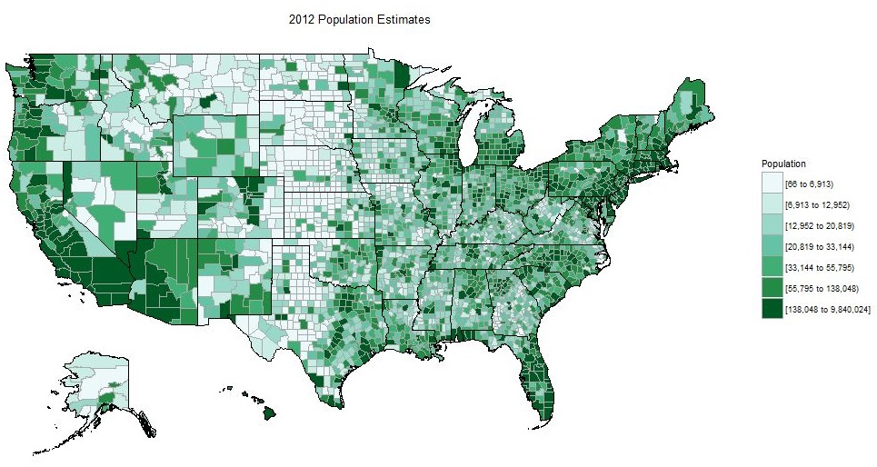
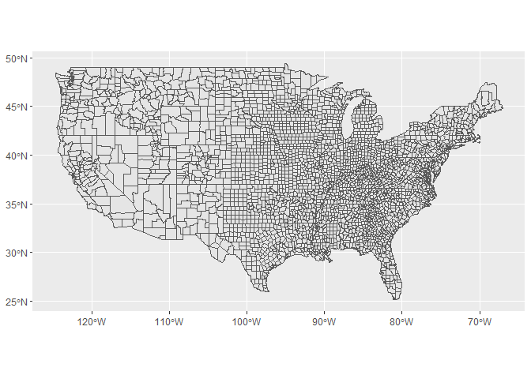
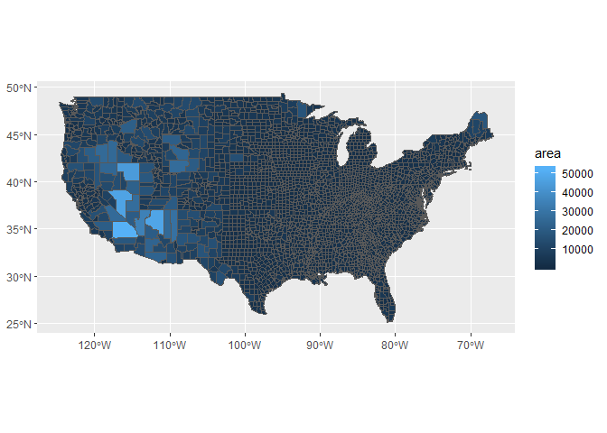
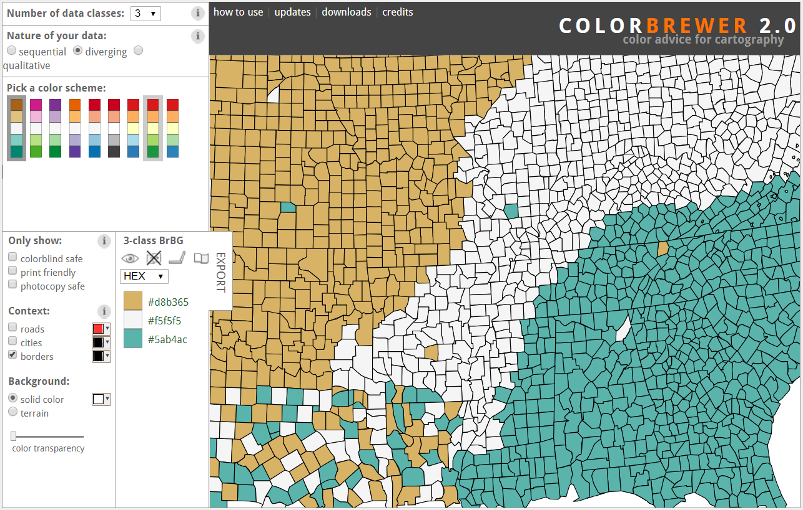
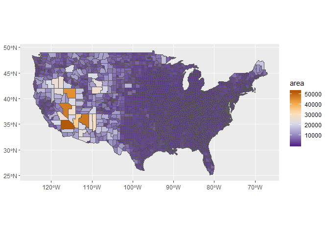
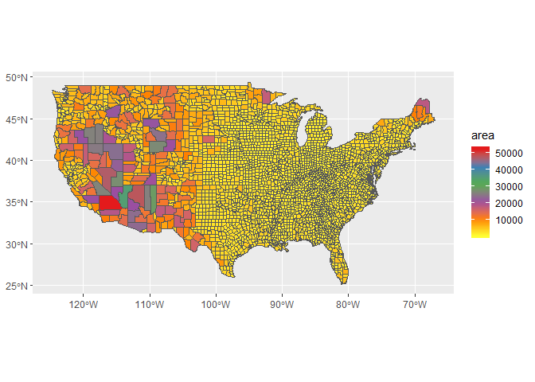
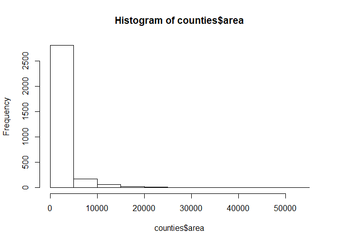
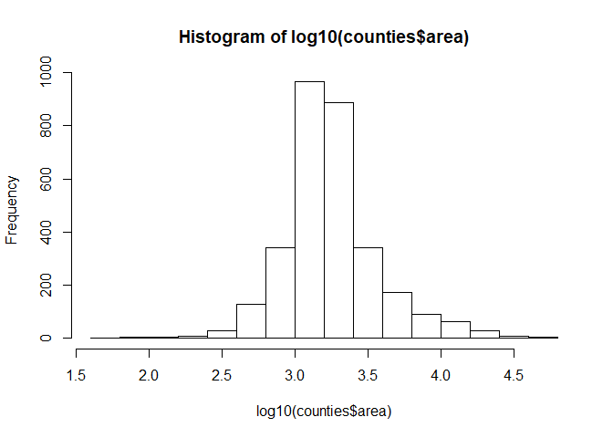
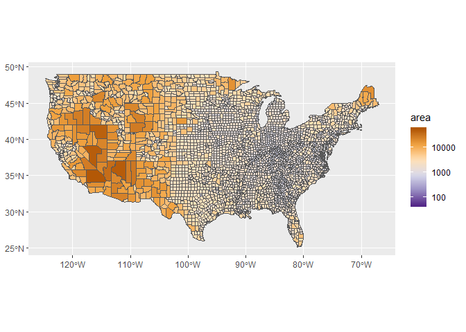

# Chloropleth maps


In the last submodule we learned a lot of the nitty gritty details of mapping point spatial data.  All of the principals we just covered will apply in this section, except now we're working with polygon data.  Specifically, we're going to cover how to plot chloropleth maps that are commonly used to display variation of data as mapped to polygons.  Going back to our original questions about why we're plotting data, these maps are used to show how a secondary variable changes by space where our spatial unit is the polygon.  These types of maps are very common so it's worth showing how they can be created in R. 



These maps are not without criticism and it's worth saying that they can sometimes obscure relationships by mis-representing scale. As we'll see later with micromaps, they also score gloriously low in the information to ink ratio.  Just keep these issues in mind when creating chloropleth maps and don't use them beyond their abilities, i.e., they are at best exploratory.

The requirement of course with chloropleth maps is the need to have secondary data to plot (other data besides spatial info). Either this is included in the data as part of the collected information or it's derived by you the analyst.  The example we'll go through now will focus on the latter example where we use simple spatial operations to estimate polygon areas as our variable to show in the map.  

Let's begin by getting a map of all counties in the United States

```r
counties <- st_as_sf(map('county', plot = F, fill = T))
ggplot() +
  geom_sf(data = counties)
```

<!-- -->

The structure of our counties dataset is pretty simple, just polygons for each county.

```r
head(counties)
```

```
## Simple feature collection with 6 features and 1 field
## geometry type:  MULTIPOLYGON
## dimension:      XY
## bbox:           xmin: -88.01778 ymin: 30.24071 xmax: -85.06131 ymax: 34.2686
## epsg (SRID):    4326
## proj4string:    +proj=longlat +datum=WGS84 +no_defs
##                ID                       geometry
## 1 alabama,autauga MULTIPOLYGON (((-86.50517 3...
## 2 alabama,baldwin MULTIPOLYGON (((-87.93757 3...
## 3 alabama,barbour MULTIPOLYGON (((-85.42801 3...
## 4    alabama,bibb MULTIPOLYGON (((-87.02083 3...
## 5  alabama,blount MULTIPOLYGON (((-86.9578 33...
## 6 alabama,bullock MULTIPOLYGON (((-85.66866 3...
```

We can leverage some of the simple functions in `sf` to estimate an area for each county polygon as a derived spatial variable.  The `st_area` function can peform this operation quickly.  You might get a warning saying you need to install the `lwgeom` package, so make sure to install as needed.


```r
area <- st_area(counties)
head(area)
```

```
## Units: m^2
## [1] 1489347617 4107738938 2331593415 1543364095 1634237932 1614622407
```

```r
class(area)
```

```
## [1] "units"
```

The area object we just creted is a "units" class, so we'll just convert it to a numeric object for simplicity.  We'll also convert it to square km from square meters. 

```r
area <- as.numeric(area) / (1000^2)
```

As you learned earlier today, the `sf` object behaves like a data frame so we can just add area as a new column.  This is why we had to first convert it to a numeric object.

```r
counties$area <- area
head(counties)
```

```
## Simple feature collection with 6 features and 2 fields
## geometry type:  MULTIPOLYGON
## dimension:      XY
## bbox:           xmin: -88.01778 ymin: 30.24071 xmax: -85.06131 ymax: 34.2686
## epsg (SRID):    4326
## proj4string:    +proj=longlat +datum=WGS84 +no_defs
##                ID     area                       geometry
## 1 alabama,autauga 1489.348 MULTIPOLYGON (((-86.50517 3...
## 2 alabama,baldwin 4107.739 MULTIPOLYGON (((-87.93757 3...
## 3 alabama,barbour 2331.593 MULTIPOLYGON (((-85.42801 3...
## 4    alabama,bibb 1543.364 MULTIPOLYGON (((-87.02083 3...
## 5  alabama,blount 1634.238 MULTIPOLYGON (((-86.9578 33...
## 6 alabama,bullock 1614.622 MULTIPOLYGON (((-85.66866 3...
```

Mapping the area to the fill aesthetic is now straight-forward and we have our first chloropleth map.

```r
ggplot() +
  geom_sf(data = counties, aes(fill = area))
```

<!-- -->

We can't really see the full variation in the areas for each county with this color ramp, only the large ones stand out. We'll change it to something with more variation using the `scale_fill_distiller` function from `ggplot2`.  We've used this function a few times now but we haven't fully explained its options.  Colors are obviously a very effective way to illustrate different values or patterns in your data but there are also a few considerations when choosing a correct color scheme.  Here are a few questions to consider:

* Is your variable categorical or continuous?
* If continuous, does one or two color hues capture the variation?
* Is a diverging palette more appropriate for your data?
* Is your color palette color-blind friendly?
* Is color even appropriate to describe patterns in your data (e.g., size instead)?

The color brewer website is a useful tool for exploring different palettes: [http://colorbrewer2.org/](http://colorbrewer2.org/)



These color palettes are all available in R through the `RColorBrewer` package, which is installed with `ggplot2`.  These palettes can be added to plots several ways but the `scale_fill_distiller` function makes it easy if you know what palette you want to use.  Let's look at our options:


These color palettes are named using the conventions on the [color brewer](http://colorbrewer2.org/) website above and are all available from `RColorBrewer`.  They are also grouped by their larger categories (from top to bottom): __sequential__, __qualitative__, and __divergent__.  

The `scale_fill_distiller` function in `ggplot2` requires the palette type and palette name arguments to create the color ramp.  The type is specified as a character string as `seq`, , `qual`, or `div` for each of the categories and the palette as a number to index the palette within each category.  The palette can also be specified by its name in the image above, e.g., `"Spectral"` or `"GnBu"`.  You don't have to specify the type argument if you use the palette name directly. 

Let's try adding a divergent palette to see if we can better see the small counties.

```r
ggplot() +
  geom_sf(data = counties, aes(fill = area)) +
  scale_fill_distiller(palette = 'PuOr')
```

<!-- -->

We could have also used the full specification by type and palette index (the PuOr palette is fourth from the bottom on the divergent scale.

```r
ggplot() +
  geom_sf(data = counties, aes(fill = area)) +
  scale_fill_distiller(type = 'div', palette = 4)
```

<!-- -->

That's better because we can see more of the range of sizes but we still can't see much with the smaller counties.  You could of course go crazy with one of the qualitative categories but there is no logical perception of the gradient with these scales.  That is, the qualitative scales are meant to show categories or nominally different groups, not a continuous change. 

```r
ggplot() +
  geom_sf(data = counties, aes(fill = area)) +
  scale_fill_distiller(type = 'qual', palette = 6)
```

```
## Warning: Using a discrete colour palette in a continuous scale.
##   Consider using type = "seq" or type = "div" instead
```

<!-- -->

So why can't we see the variation among the smaller counties? Let's take a look at the ranges in the data using a simple histogram.

```r
hist(counties$area)
```

<!-- -->

These data are heavily skewed to the left so most of the interesting variation in sizes among the smaller counties can't be seen. We can better see the variation if we transform the data.

```r
hist(log10(counties$area))
```

<!-- -->

We can just as easily transform the color scale to accommodate the skewed nature of the data.  We can more clearly see the patterns this way. Using the transformation we can see that now most counties are at least 1000 square kilometers in size and very few are greaterthan 10000 square kilometers. The really small purple ones are in the minority.

```r
ggplot() +
  geom_sf(data = counties, aes(fill = area)) +
  scale_fill_distiller(palette = 'PuOr', trans = 'log10')
```

<!-- -->

There are even more effective ways to see variation among county size that we'll cover in the next module.  The important message here is to consider what you want to see with the map and how colors and/or transformations can aid in that description.  

### Exercise

In this exercise we'll make a chloropleth map of state areas, just as we did above but at a coarser scale.  The variation in state sizes is not as extreme as for counties so you should not have to worry about transformations. 

1. Make a new code chunk in your R Markdown file and load the `sf`, `maps`, and `ggplot2` libraries.

1. Create an `sf` object of states from the `maps` package: `states <- st_as_sf(map('state', plot = F, fill = T))`

1. Use the `st_area` function to estimate the area of each state.  Make this a numeric object (`as.numeric`), convert it to square kilometers (divide by `1e6`), and bind it to the states object you just created (`states$area <- area`).

1. Plot the `sf` object with area using `ggplot` and `geom_sf()`.  Map area to colour by defining the plot aesthetics (i.e., add `geom_sf(states, aes(colour = area))` to `ggplot()` using `+`).

1. Use `scale_colour_distiller` to change the colour scale.  Pick a divergent palette (`type  = 'div'`) and a palette of your choice (set palette as 1 through 9). 

<details> 
  <summary>Click here to cheat!</summary>
   <script src="https://gist.github.com/fawda123/9315d9d975874e14340daccc0cd80274.js"></script>
</details>
