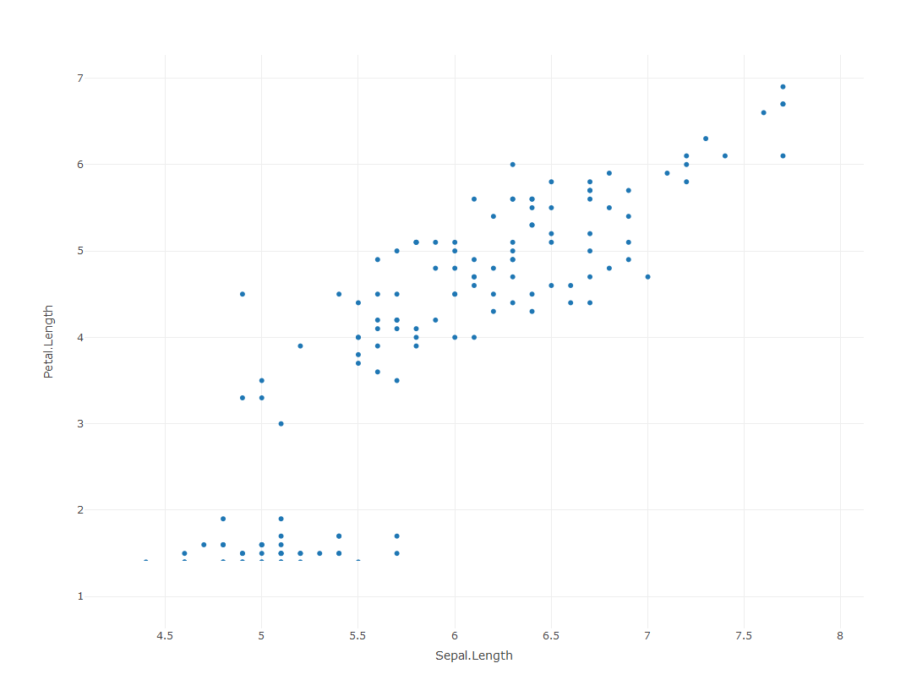

# plotly and Mapview


__The plots on this submodule are not interactive, please visit the page [here](https://fawda123.github.io/sfs-r-gis-2018-supp/modules/plotly-and-mapview.html) for the full experience!__

We've seen how to use some of the basic plotting features in R to create static maps in the last two sub-modules.  Although static maps are still the de facto format for publications, interacting with the plot data can be much more informative.  R is no longer limited to static plotting since several new package have been introduced in the last few years.  Most of these packages link R code to existing plotting libraries that were developed in other languages (e.g., JavaScript).  Many of these new packages also work well with web integration, adding a new level of experience and collaboration to your owrk.  These are not new packages in the computing world, just new to the R universe.  They are insanely easy to use if you know just a bit of R code and they interface really well with R Markdown.  

We'll introduce the following packages in this submodule:

* [plotly](https://plot.ly/r/): interactive graphs in R, not limited to maps
* [mapview](https://github.com/r-spatial/mapview): quick interactive maps to examine eand visually investigate geometries and attributes of spatial data

<!-- https://moderndata.plot.ly/visualizing-geo-spatial-data-with-sf-and-plotly/ -->

### plotly

The plotly library lets you easily create interactive plots in R.  We'll need the development version of plotly for our examples, so run the following code if you haven't done so already.


```r
install.packages("devtool")
library(devtools)
install_github("ropensci/plotly")
```

Now can load the plotly library and create a simple scatterplot. 


```r
library(plotly)
p <- plot_ly(data = iris, x = ~Sepal.Length, y = ~Petal.Length)
p
```
<!-- -->

We can see in this simple scatter plot many of the added features that are provided with plotly.  Mouse over any of the points and you can see the corresponding values on the x and y axes.  Different subsets of the data can also be emphasized with the zooming options.    

A nice feature of the plotly library is the seamless integration with ggplot.  The `ggplotly` function can be appended to any ggplot object to convert it to an interactive plotly chart. If you know how to use ggplot, you can use plotly. 


```r
p <- ggplot(data = iris, aes(x = Petal.Width, fill = Species)) + 
  geom_histogram()
ggplotly(p)
```
<!-- -->

Plotly is also very adept at creating three-dimensional plots, which of course requires three-dimensional data.


```r
plot_ly(z = ~volcano, type = 'surface')
```


In addition to being a really neat addition to general plotting, you can imagine some of the advantages that plotly might have for mapping or viewing spatial data.  Let's return to our examples from the last module to look at the area of counties in the United Sates.


```r
# create sf object for states, estimate and add area
states <- st_as_sf(map('state', plot = F, fill = T))
area <- st_area(states)
area <- as.numeric(area) / (1000^2)
states$area <- area
```

The development version of plotly can work directly with `sf` objects (noticing a theme here?) 


```r
plot_ly(states)
```
<!-- -->

This is our basemap so let's change some of the arguments to make the map more useful.

* `split` defines a grouping variable using a column in the input data, without this the color wan't map to anything and it also defines what we see on mouse-over
* `color` identifies the column in the data to map
* `showlegend` can toggle the legend for the splitting variable, here we don't need it
* `alpha` sets the transparency of the polygons, we don't see the polygon borders if we set the transparency as completely opaque


```r
plot_ly(states, split = ~ID, color = ~ area, showlegend = F, alpha = 1)
```
<!-- -->

We can also change the color scheme with the `colors` (note plural) argument.  We can use any of the palettes from RColorBrewer.


```r
plot_ly(states, split = ~ID, color = ~ area, colors = 'PiYG', showlegend = F, alpha = 1)
```
<!-- -->

As a side note, this same code works for the counties data we used in the last sub-module.  It just takes a while render... try this code on your own. 


```r
# get counties as sf object
counties <- st_as_sf(map('county', plot = F, fill = T))

# estimate area, append to counties
area <- st_area(counties)
area <- as.numeric(area) / (1000^2)
counties$area <- area

# make plotly
plot_ly(counties, split = ~ID, color = ~ area, colors = 'PiYG', showlegend = F, alpha = 1)
```

Now let's put some of these javascript tools to use.  A really cool feature of plotly is the ability to link plots through interactive brushing, such as highligtings parts of one plot and seeing where they correspond on another plot.  For example, it's clear to see from our chloropleth map of state area which one is the biggest.  But what are the top ten largest states?  Can we setup the plots in a way to help us view this information?  

The crosstalk package lets you link plotly objects.  This package is installed automatically when you install plotly, but you'll have to load it to use its features. There are a couple steps that need to happen to link the plots.  

1) Create a `SharedData` object for the data you're using in both plots
1) Create both plots from the `SharedData` object by specifying how higlighing or brushing happens to select the plot elements
1) Link the two plots using the `bscols` function.

We'll make this example using our states area dataset by creating a map as we've done before and also creating a histogram of all the areas.  Step by step it looks like this:

First we load the crosstalk package and create our `SharedData` object from our states data.

```r
library(crosstalk)

# create a shareddata object from states
sts <- SharedData$new(states)
```

Then we can create our separate plots, the first is the histogram and the second is the map.  There are two things to point out:

* First is use of the pipe operator, `%>%`, from the magrittr package that chains several functions together.  This package is a common dependency and was loaded when you loaded crosstalk. It's there simply for convenience.
* The second point is the `highlight` function and the arguments for each plot.  Without using highlight, we would only be able to zoom and pan in these plots.  The highlight function lets us actually select features.  We've also chosen different arguments for each plot. These are described in more detail in the help file (`?highlight`), but briefly:
     * The `on` argument defines how a user makes a selection on the plot, e.g., on click, hover, etc. Here we've specified using a rectangular box for selection.
     * The `persistent` argument defines whether or not the selections accumulate, i.e., a new selection is added to the previous.
     * The `dynamic` argument lets us add a widget for changing selection colors, i.e., if we want different colors for different selections.
     

```r
# histogram of area
state_hist <- plot_ly(sts, x = ~ area) %>%
  add_histogram(xbins = list(start = 0, end = 1e6, size = 1e4)) %>%
  layout(barmode = "overlay") %>%
  highlight(on = "plotly_selected", persistent = TRUE)

# state map, we're not mapping area anymore
state_map <- plot_ly(sts) %>%
  highlight(persistent = T, dynamic = T)
```

Finally, we use the `bscols` function to show the two plots together:

```r
bscols(
  state_hist,
  state_map
)
```


Linked scatterplots can also be created.  These can add an entirely new level of insight into spatial relationships among variables by showing you not only where observations occur on the landscape but also how they co-vary.  

We can repurpose our code from the last example to create a linked scatterplot using the `meuse` dataset from the `sp` package.  We'll create a scatterplot of cadmium vs. elevation and a simple map of the sample sites.  Note that we have to include the `add_markers()` function to create the scatterplot for an `sf` object.


```r
# load sp library for meuse data
library(sp)
data(meuse)

# create sf object for meuse
dat <- st_as_sf(meuse, coords = c('x', 'y'), crs = "+init=epsg:28992")

# create a shareddata object for meuse
datshr <- SharedData$new(dat)

# scatterplot
meuse_sct <- plot_ly(datshr, x = ~ elev, y = ~ cadmium) %>%
  add_markers() %>% 
  highlight(on = "plotly_selected", persistent = TRUE)

# map
meuse_map <- plot_ly(datshr) %>%
  highlight(persistent = T, dynamic = T)

# combine scatterplot and map
bscols(
  meuse_sct, 
  meuse_map
)
```


### mapview

You'll find that you can create most any type of map using plotly, but where it currently doesn't excel is the ability to use basemaps.  There's actually a function for doing this in plotly (`plot_mapbox()`), but it requires additional web authentication and doesn't include some of the options on the map that mapview can provide.  For now, mapview is a good go-to package for viewing spatial data with a wide range of options for basemaps.  It also works out of the box with `sf` objects.   


```r
library(mapview)
mapview(breweries)
```


You'll notice a couple features on the map that are worth pointing out.

* Mouseover information at the top showing the coordinate system, projection, mouse location, and zoom level.
* Zoom button on the top left, but you can also zoom with the mouse.
* An option for choosing the basemap, which I think is the coolest option.
* A scale bar on the bottom left that changes with zoom. 
* A button on the bottom-right that will snap zoom to the plotted layer.
* Clicking on a features brings up a table with detaield information.

Mapview will recognize the type of features in the input data to make the correct plot.  Here's an example using our states dataset where polygons are automatically plotted.


```r
mapview(states, zcol= "area")
```


You'll notice that the basemap becomes more detailed as we zoom in.  This is a really nice feature of mapview called tiling that is essential when looking at data at different scales and one of the reasons why the maps render so quickly.  

It's also worth mentioning that mapview is built off of the leaflet package. Mapview is kind of like a lightweight version of leaflet, so if you want full customization and the ability add more information, check out the [Leaflet for R](https://rstudio.github.io/leaflet/) introduction.   

### Exercise

For this exercise we'll download the US EPA's Wadeable Streams Assessment (WSA) data and make some simple plotly and mapview graphics. These are point data that describe different monitoring sites at streams throughout the US. 

1) Make a new code chunk in your R Markdown file and load the `sf`, `plotly`, and `mapview` packages.

1) Run the following code to download the data: 

1) Convert the wsa data to an `sf` object with the following: `wsa <- st_as_sf(wsa, coords = c("LON_DD", "LAT_DD"), crs = 4269,agr = "constant")`

1) Use `plot_ly` to create a scatterplot of the variables `XELEV` and `WSAREA`.  Remember that we have to use `add_markers()` to create a scatterplot with `sf` objects.  If you're ggplot savvy, try creating a ggplot object first and then using `ggplotly`

1) Use `mapview` to create a map of the stream sites.  Try using `XELEV` or `WSAREA` to color the points.  Alternatively, try a categorical variable for color, e.g., `ECOWSA9`.  Try changing the base map on the plot to find one that you like. 

<details> 
  <summary>Click here to cheat!</summary>
   <script src="https://gist.github.com/fawda123/1870bb6f093b86139addcc515503a39e.js"></script>
</details>
