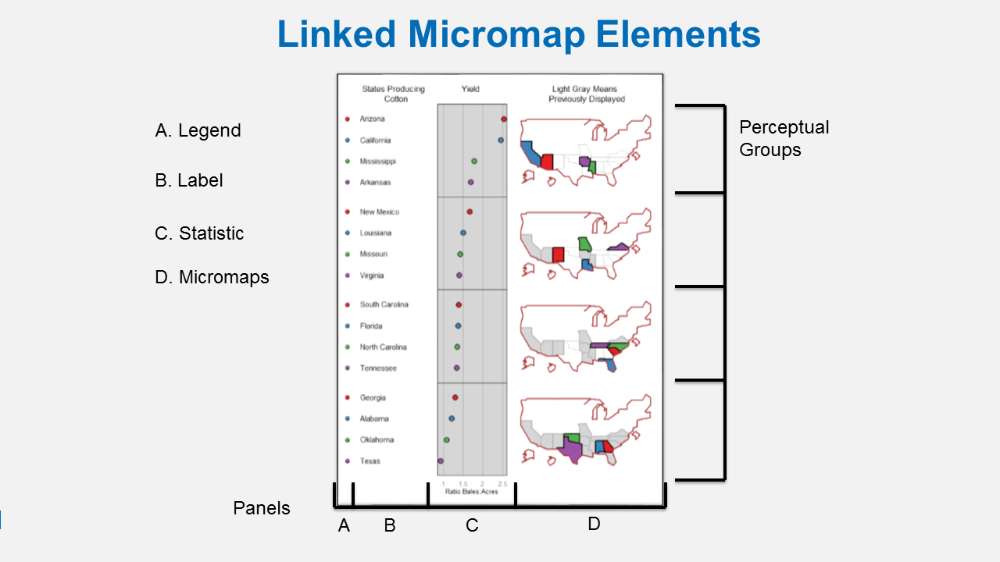

```{r echo = F, message = F, warning = F}
knitr::opts_chunk$set(fig.path = '../../../img/', message = F, warning = F)

library(tidyverse)
library(maps)
library(sf)
library(raster)
library(tmap)
library(micromap)
library(ggrepel)
library(plotly)

```
In this final module we'll cover some useful packages for exploratory spatial data analysis, as well as general mapping.  There are other packages available for R that can accomplish these tasks but we don't have time to cover them all.  We'll focus specifically on the micromap and tmap packages because of their unique functionality relative to more generic mapping packages.

## micromap

A linked micromap is a graphic that simultaneously summarizes and displays statistical and geographic distributions by a color-coded link between statistical summaries of polygons to a series of small maps. The package is described in full in an [article](https://www.jstatsoft.org/article/view/v063i02) published in the Journal of Statistical Software. This figure shows the four elements of a linked micromap. 



A recent study by [McManus et al. (2016)](https://onlinelibrary.wiley.com/doi/full/10.1111/1752-1688.12399) used linked micromaps to summarize water quality data collected from a spatially balanced, probabilistic stream survey of 25 watersheds done by West Virginia Department of Environmental Protection.  That visualization led to a multivariate spatial analysis based on the contiguity of the watersheds, which was based on work done in R by [Dray and Jombart (2011)](https://www.jstor.org/stable/23069330?seq=1#page_scan_tab_contents) and [Dray et al. (2012)](https://esajournals.onlinelibrary.wiley.com/doi/abs/10.1890/11-1183.1).

The dataset was created by summarizing watershed land use from NLCD data and appending the information to a shapefile of waterbody IDs. We've included the shapefile with the workshop data, which should be in your data folder.  Since micromap does not work with `sf` objects, we'll import it as a `SpatialPolygonsDataFrame` object using the `readOGR` function from the rgdal package.
```{r eval = F}
shp <- readOGR(dsn = './data', layer = "micromap_dat")
```
```{r echo = F, message = F, results = 'hide'}
shp <- readOGR(dsn = '../../../files/data', layer = "micromap_dat")
```
```{r}
class(shp)
```
```{r}
head(shp@data)
```
```{r}
plot(shp)
```

The minimal requirements to create a micromap are defined using these arguments for the `mmplot` function:

* `map.data` The input data object.
* `panel.types` The types of panels to include in the micromap.
* `panel.data` The data (columns) in `map.data` to use for each panel type.

The rest of the arugments below are optional.  These define which variable the plot is sorted by (`ord.by`), if the axes are flipped (`rev.ord`), how many observations are in each perceptual group (`grouping`), and whether or not to include a median row (`median.row`).
```{r micromap1, fig.height = 7, fig.width = 9}
mmplot(map.data = shp,
       panel.types = c('dot_legend', 'labels', 'box_summary', 'box_summary', 'map'),
       panel.data=list(NA,
                       'huc12name',
                       list('cropmin', 'cropq1', 'cropmed', 'cropq3', 'cropmax'),
                       list('decidmin', 'decidq1', 'decidmed', 'decidq3', 'decidmax'),
                       NA),
       ord.by = 'cropmed',
       rev.ord = TRUE,
       grouping = 6,
       median.row = FALSE
       )
```

There are also a staggering array of options to customize the elements of the micromap. These are passed as a list of lists that correspond to the order of the `panel.types`.  You can view the vignette for micromap to see the entire range of options (run `vignette('Introduction_Guide', package = 'micromap')` in the console to open the pdf).  

```{r micromap2, fig.height = 7, fig.width = 9}
mmplot(map.data = shp,
  panel.types = c('dot_legend', 'labels', 'box_summary', 'box_summary', 'map'),
  panel.data=list(NA,
                  'huc12name',
                  list('cropmin', 'cropq1', 'cropmed', 'cropq3', 'cropmax'),
                  list('decidmin', 'decidq1', 'decidmed', 'decidq3', 'decidmax'),
                  NA),
  ord.by = 'cropmed',
  rev.ord = TRUE,
  grouping = 6,
  median.row = FALSE,
  panel.att=list(list(1, panel.width=.8, point.type=20, point.size=2,point.border=FALSE, xaxis.title.size=1),
                 list(2, header='WBD HUC12', panel.width=1.25, align='center', text.size=1.1),
                 list(3, header='2011 NLCD\nCropland',graph.bgcolor='white',
                    xaxis.ticks=c( 0, 25, 50, 75, 100),
                    xaxis.labels=c(0, 25, 50, 75, 100),
                    xaxis.labels.size=1,
                    xaxis.title='Percent',
                    xaxis.title.size=1,
                    graph.bar.size = .6),
                 list(4, header='2011 NLCD\nDeciduous Forest',
                    graph.bgcolor='white',
                    xaxis.ticks=c( 0, 25, 50, 75, 100),
                    xaxis.labels=c(0, 25, 50, 75, 100),
                    xaxis.labels.size=1,
                    xaxis.title='Percent',
                    xaxis.title.size=1,
                    graph.bar.size = .6),
                 list(5, header='Micromaps',
                    inactive.border.color=gray(.7),
                    inactive.border.size=2)
                 )
  )

```

Now compare the linked micromap with two choropleth maps that represent similar information.  We get the same conclusion but the micromap adds much more context and has a higher information to ink ratio.  
```{r chlorocntrst, echo = F}
library(tmap)
qtm(shp = shp, fill = c("cropmed", "decidmed"), fill.palette = c("Blues"), ncol = 2)
```

## tmap 

tmap is a newish R package for creating thematic maps based on the grammar of graphics (gg) approach used with ggplot2. An [article](https://www.jstatsoft.org/article/view/v084i06) was recently published in the Journal of Statistical Software that describes the package in detail. 

The chloropleth map we just saw was created with tmap:

```{r, eval = F}
library(tmap)
qtm(shp = shp, fill = c("cropmed", "decidmed"), fill.palette = c("Blues"), ncol = 2)
```

The package can do a lot of cool things but we'll just cover a few of them here.  You can have a look at the article for more details. This is the first figure from the paper:
```{r tmapex1}
data("World", "metro", package = "tmap")
metro$growth <- (metro$pop2020 - metro$pop2010) / (metro$pop2010 * 10) * 100

m1 <- tm_shape(World) +
  tm_polygons("income_grp", palette = "-Blues", 
    title = "Income class", contrast = 0.7, border.col = "grey30", id = "name") +
  tm_text("iso_a3", size = "AREA", col = "grey30", root = 3) +
  tm_shape(metro) +
  tm_bubbles("pop2010", col = "growth", border.col = "black",
    border.alpha = 0.5,
    breaks = c(-Inf, 0, 2, 4, 6, Inf) ,
    palette = "-RdYlGn",
    title.size = "Metro population (2010)", 
    title.col = "Annual growth rate (%)",
    id = "name",
    popup.vars = c("pop2010", "pop2020", "growth")) + 
  tm_format_World() + tm_style_gray(frame.lwd = 2)
m1
```

Here are some other cool plots from the vignette.

Informative chloropleth maps:
```{r}
data(Europe)

qtm(Europe, fill="well_being", text="iso_a3", text.size="AREA", format="Europe", style="gray", 
    text.root=5, fill.title="Well-Being Index", fill.textNA="Non-European countries")
```

Raster and bubble plots:
```{r}
data(land, rivers, metro)

tm_shape(land) + 
    tm_raster("trees", breaks=seq(0, 100, by=20), legend.show = FALSE) +
tm_shape(Europe, is.master = TRUE) +
    tm_borders() +
tm_shape(rivers) +
    tm_lines(lwd="strokelwd", scale=5, legend.lwd.show = FALSE) +
tm_shape(metro) +
    tm_bubbles("pop2010", "red", border.col = "black", border.lwd=1, 
        size.lim = c(0, 11e6), sizes.legend = c(1e6, 2e6, 4e6, 6e6, 10e6), 
        title.size="Metropolitan Population") +
    tm_text("name", size="pop2010", scale=1, root=4, size.lowerbound = .6, 
        bg.color="white", bg.alpha = .75, 
        auto.placement = 1, legend.size.show = FALSE) + 
tm_format_Europe() +
tm_style_natural()
```

Facets:
```{r}
tm_shape(Europe) +
    tm_polygons("well_being", title="Well-Being Index") +
    tm_facets("part", free.coords=FALSE) +
tm_style_grey()
```

## Exercise

This is our last exercise of the workshop.  We'll make a quick chloropleth map of state area using the `qtm` function from tmap.  We'll map color to area of the states and add the state names as text.

1. Make a new code chunk in your R Markdown file and load the `sf`, `maps`, and `tmap` packages.

1. Create an `sf` object of states from the `maps` package: `states <- st_as_sf(map('state', plot = F, fill = T))`

1. Use the `st_area` function to estimate the area of each state.  Make this a numeric object (`as.numeric`), convert it to square kilometers (divide by `1e6`), and bind it to the states object you just created (`states$area <- area`).

1. Use the `qtm` function from tmap to plot the `states` object.  Use the arguments `fill = "area"`, `text = "ID"`, `fill.title = "State area (km2)"`, and `text.size = "area"`.

1. We can place the legend outside of the plot by using `tm_layout(legend.outside = T)`.  Just add this code to the plot using the `+` sign as you would for ggplot.  

<details> 
  <summary>Click here to cheat!</summary>
   <script src="https://gist.github.com/fawda123/6b0af282e7f95ba451e0c7879a13f1cc.js"></script>
</details>

