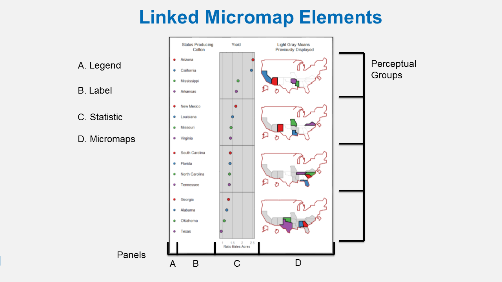
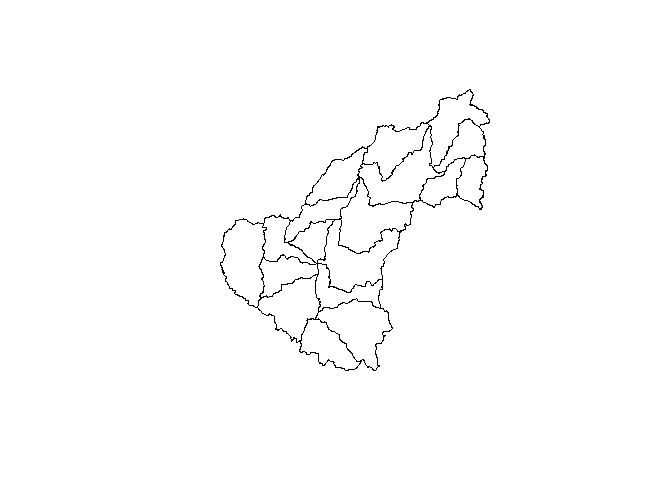
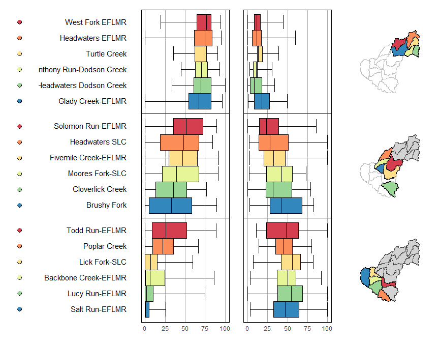
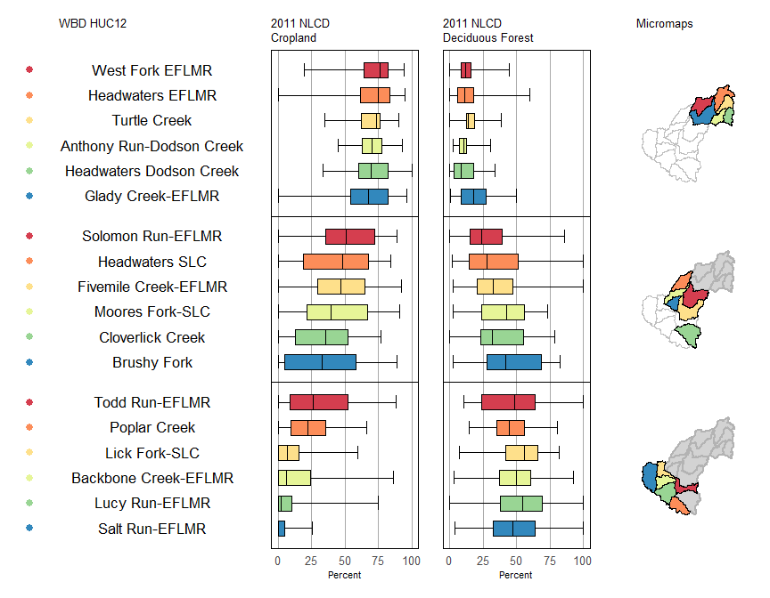
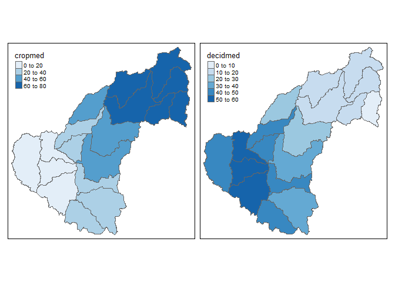
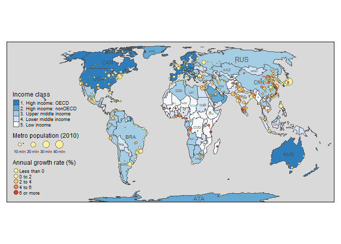
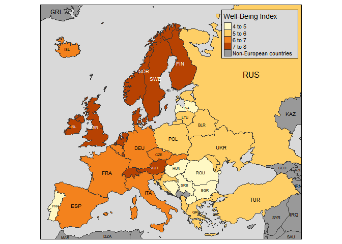
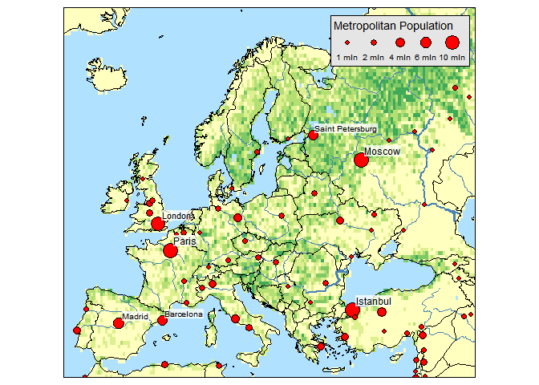

In this final module we'll cover some useful packages for exploratory spatial data analysis, as well as general mapping.  There are other packages available for R that can accomplish these tasks but we don't have time to cover them all.  We'll focus specifically on the micromap and tmap packages because of their unique functionality relative to more generic packages.

## micromap

A linked micromap is a graphic that simultaneously summarizes and displays both statistical and geographic distributions by a color-coded link between statistical summaries of polygons to a series of small maps. This  figure shows the four elements of a linked micromap. The package is described in full in an [article](https://www.jstatsoft.org/article/view/v063i02) published in the Journal of Statistical Software.



A recent study by [McManus et al. (2016)](https://onlinelibrary.wiley.com/doi/full/10.1111/1752-1688.12399) used linked micromaps to summarize water quality data collected from a spatially, balanced probabilistic stream survey of 25 watersheds done by West Virginia Department of Environmental Protection.  That visualization led to a multivariate spatial analysis based on the contiguity of the watersheds, which was based work done in R by [Dray and Jombart (2011)](https://www.jstor.org/stable/23069330?seq=1#page_scan_tab_contents) and [Dray et al. (2012)](https://esajournals.onlinelibrary.wiley.com/doi/abs/10.1890/11-1183.1).

The dataset was created by summarizing watershed land use from NLCD data and appending the information to a shapefile of waterbody IDs. We've included the shapefile with the workshop data.

```r
shp <- readOGR(dsn = '../../../files', layer = "micromap_dat")
```

```
## OGR data source with driver: ESRI Shapefile 
## Source: "C:\proj\sfs-r-gis-2018\files", layer: "micromap_dat"
## with 18 features
## It has 16 fields
```

```r
class(shp)
```

```
## [1] "SpatialPolygonsDataFrame"
## attr(,"package")
## [1] "sp"
```

```r
head(shp@data)
```

```
##              huc12name    HUC_8     HUC_10       HUC_12 SHAPE_Leng
## 0         Poplar Creek 05090202 0509020212 050902021201  0.4195477
## 1     Cloverlick Creek 05090202 0509020212 050902021202  0.5463019
## 2       Lucy Run-EFLMR 05090202 0509020212 050902021203  0.4973302
## 3       Todd Run-EFLMR 05090202 0509020211 050902021103  0.5480372
## 4 Backbone Creek-EFLMR 05090202 0509020212 050902021204  0.4219615
## 5 Fivemile Creek-EFLMR 05090202 0509020211 050902021102  0.7076978
##    SHAPE_Area  decidmin  decidq1 decidmed  decidq3  decidmax cropmin
## 0 0.006644419 14.241294 34.76991 44.45805 55.83815  80.19169       0
## 1 0.011394350  0.000000 23.24940 31.97533 55.01489  78.54488       0
## 2 0.009360098  0.000000 37.68705 54.62358 68.85654 100.00000       0
## 3 0.005664223 10.656934 23.45861 48.14815 63.79253 100.00000       0
## 4 0.005609581  3.076923 36.94350 50.00000 60.61446  92.39130       0
## 5 0.011479134  2.340597 20.32731 32.72323 46.97142 100.00000       0
##       cropq1   cropmed    cropq3  cropmax
## 0  9.4912281 22.243602 35.559410 66.54229
## 1 13.1047342 35.458902 52.056075 76.81607
## 2  0.0000000  1.881660  9.820335 74.73684
## 3  8.9527296 26.086957 52.093989 88.38863
## 4  0.3770609  6.280992 24.462801 86.12818
## 5 29.4473001 47.104019 64.995053 92.09040
```

```r
plot(shp)
```

<!-- -->

The latest release of micromap can plot a SpatialPolygonsDataFrame object directly (there are plans to further develop the package to work with `sf` objects).  There are few required pieces of information:

* `map.data`The input data object.
* `panel.types` The types of panels to include in the micromap.
* `panel.data` The data in `map.data` that are linked to the panels.

The rest is optional and defines which varialbe defines the plot ranking (`ord.by`), if the axes are flipped (`rev.ord`), how many observations are in each perceptual group (`grouping`), and whether or not to include a median row (`median.row`).

```r
mmplot(map.data = shp,
       panel.types = c('dot_legend', 'labels', 'box_summary', 'box_summary', 'map'),
       panel.data=list(NA,
                       'huc12name',
                       list('cropmin', 'cropq1', 'cropmed', 'cropq3', 'cropmax'),
                       list('decidmin', 'decidq1', 'decidmed', 'decidq3', 'decidmax'),
                       NA),
       ord.by = 'cropmed',
       rev.ord = TRUE,
       grouping = 6,
       median.row = FALSE
       )
```

<!-- -->

There are a staggering array of options to customize the elements of the micromap. These are passed as a list of lists that correspond to the order of the `panel.types`.  You can view the vignette for micromap to see the entire range of options (run `vignette('Introduction_Guide', package = 'micromap')` in the console to open the pdf).  


```r
mmplot(map.data = shp,
  panel.types = c('dot_legend', 'labels', 'box_summary', 'box_summary', 'map'),
  panel.data=list(
    NA,
   'huc12name',
   list('cropmin', 'cropq1', 'cropmed', 'cropq3', 'cropmax'),
   list('decidmin', 'decidq1', 'decidmed', 'decidq3', 'decidmax'),
   NA),
  ord.by = 'cropmed',
  rev.ord = TRUE,
  grouping = 6,
  median.row = FALSE,
  panel.att=list(list(1, panel.width=.8, point.type=20, point.size=2,point.border=FALSE, xaxis.title.size=1),
                 list(2, header='WBD HUC12', panel.width=1.25, align='center', text.size=1.1),
                 list(3, header='2011 NLCD\nCropland',graph.bgcolor='white',
                    xaxis.ticks=c( 0, 25, 50, 75, 100),
                    xaxis.labels=c(0, 25, 50, 75, 100),
                    xaxis.labels.size=1,
                    xaxis.title='Percent',
                    xaxis.title.size=1,
                    graph.bar.size = .6),
                 list(4, header='2011 NLCD\nDeciduous Forest',
                    graph.bgcolor='white',
                    xaxis.ticks=c( 0, 25, 50, 75, 100),
                    xaxis.labels=c(0, 25, 50, 75, 100),
                    xaxis.labels.size=1,
                    xaxis.title='Percent',
                    xaxis.title.size=1,
                    graph.bar.size = .6),
                 list(5, header='Micromaps',
                    inactive.border.color=gray(.7),
                    inactive.border.size=2))
  )
```

<!-- -->

Now compare the linked micromap with two choropleth maps.  We get a similer conclusion but the micromap adds much more context.  
<!-- -->

## tmap 

tmap is a newish R package for creating thematic maps and based on the layered grammar of graphics approach Hadley Wickham uses with ggplot2. An [article](https://www.jstatsoft.org/article/view/v084i06) was recently published in the Journal of Statistical Software that describes the package in detail. 

The chloropleth map we just saw was created with tmap:


```r
library(tmap)
qtm(shp = shp, fill = c("cropmed", "decidmed"), fill.palette = c("Blues"), ncol = 2)
```

The package can do a lot of cool things but we'll just cover a few of them here.  You can have a look at the article for more details. This is the first figure from the paper:

```r
data("World", "metro", package = "tmap")
metro$growth <- (metro$pop2020 - metro$pop2010) / (metro$pop2010 * 10) * 100

m1 <- tm_shape(World) +
  tm_polygons("income_grp", palette = "-Blues", 
    title = "Income class", contrast = 0.7, border.col = "grey30", id = "name") +
  tm_text("iso_a3", size = "AREA", col = "grey30", root = 3) +
  tm_shape(metro) +
  tm_bubbles("pop2010", col = "growth", border.col = "black",
    border.alpha = 0.5,
    breaks = c(-Inf, 0, 2, 4, 6, Inf) ,
    palette = "-RdYlGn",
    title.size = "Metro population (2010)", 
    title.col = "Annual growth rate (%)",
    id = "name",
    popup.vars = c("pop2010", "pop2020", "growth")) + 
  tm_format_World() + tm_style_gray(frame.lwd = 2)
m1
```

<!-- -->

Here are some other cool plots from the vignette.

Informative chloropleth maps:

```r
data(Europe)

qtm(Europe, fill="well_being", text="iso_a3", text.size="AREA", format="Europe", style="gray", 
    text.root=5, fill.title="Well-Being Index", fill.textNA="Non-European countries")
```

<!-- -->

Raster and bubble plots:

```r
data(land, rivers, metro)

tm_shape(land) + 
    tm_raster("trees", breaks=seq(0, 100, by=20), legend.show = FALSE) +
tm_shape(Europe, is.master = TRUE) +
    tm_borders() +
tm_shape(rivers) +
    tm_lines(lwd="strokelwd", scale=5, legend.lwd.show = FALSE) +
tm_shape(metro) +
    tm_bubbles("pop2010", "red", border.col = "black", border.lwd=1, 
        size.lim = c(0, 11e6), sizes.legend = c(1e6, 2e6, 4e6, 6e6, 10e6), 
        title.size="Metropolitan Population") +
    tm_text("name", size="pop2010", scale=1, root=4, size.lowerbound = .6, 
        bg.color="white", bg.alpha = .75, 
        auto.placement = 1, legend.size.show = FALSE) + 
tm_format_Europe() +
tm_style_natural()
```

<!-- -->

Facets:

```r
tm_shape(Europe) +
    tm_polygons("well_being", title="Well-Being Index") +
    tm_facets("part", free.coords=FALSE) +
tm_style_grey()
```

<!-- -->

## Exercise

This is our last exercise of the workshop.  We'll make a quick chloropleth map of state area using the `qtm` function from tmap.  We'll map color to area of the states and add the state names as text.

1. Make a new code chunk in your R Markdown file and load the `sf`, `maps`, and `tmap` packages.

1. Create an `sf` object of states from the `maps` package: `states <- st_as_sf(map('state', plot = F, fill = T))`

1. Use the `st_area` function to estimate the area of each state.  Make this a numeric object (`as.numeric`), convert it to square kilometers (divide by `1e6`), and bind it to the states object you just created (`states$area <- area`).

1. Use the `qtm` function to plot the `states` object.  Use the arguments `fill = "area"`, `text = "ID"`, `fill.title = "State area (km2)"`, and `text.size = "area".

1. We can place the legend outside of the plot by using `tm_layout(legend.outside = T)`.  Just add this code to the plot using the `+` sign as you would for ggplot.  

<details> 
  <summary>Click here to cheat!</summary>
   <script src="https://gist.github.com/fawda123/6b0af282e7f95ba451e0c7879a13f1cc.js"></script>
</details>

