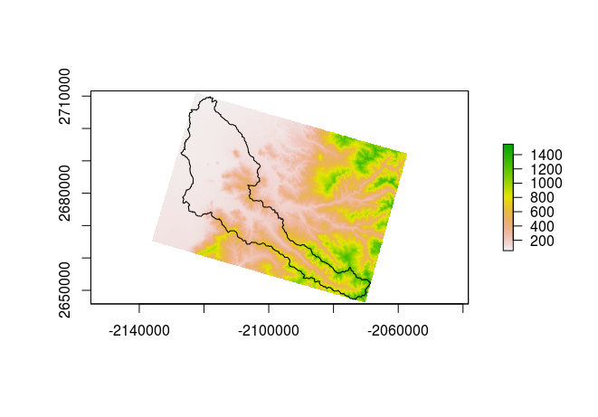

In this section, we'll play with real data and demonstrate some of the nice features of working with the `raster` package. 

### Lessong Goals
By the end of this section you will be able to: 
- Read and write raster data from disk and from the web
- Clip raster data
- More...

---

#### Reading & Writing Raster Data

Reading and writing raster data into R is as simple as...

```r
library(raster);library(rgdal)
#Reading
cal_elev <- raster('./data/calapooia.tif')
#Writing
writeRaster(cal_elev, './data/calapooia.tif', format="GTiff", overwrite=TRUE)
```

The `raster` package can handle many different formats other than `GeoTiff` and can generally interpret these formats when reading. However, you will need to specify the format when writing. 

#### Reprojecting Rasters

As we noted previously, it is critical that your data all be in the same projection for analysis. Like many applications, it's useful to use an equal-area projection for rasters as well. Let's suppose we have a watershed polygon that is in the desired projection and we want our raster to match that projection. 

```r
ws = readOGR(dsn = './data', layer = 'calapooia-ws')
proj4string(ws) == proj4string(cal_elev)
cal_elev <- projectRaster(cal_elev, crs = proj4string(ws), 
                          res=90, method='bilinear')
cal_elev
plot(cal_elev)
plot(ws, add = T)
```


Note that if we inspect cal_elev that its sources is now `in memory`. To retain this reprojected raster we would have to save it again with `writeRaster`.


