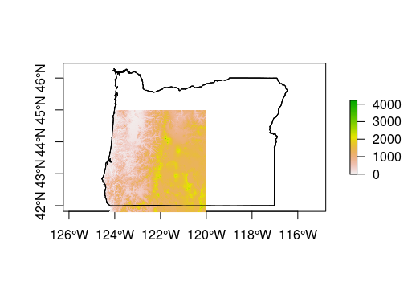

## Working with Rasters

---

In this section, we'll play with real data and demonstrate some of the nice features of working with the `raster` package. 

### Lesson Goals

By the end of this section you will be able to: 
- Read and write raster data from the web or from disk
- Crop raster data
- Reproject raster data to a different coordinate system
- Calculate a suite of potentially useful terrain metrics for watershed analysis

---

### Excercise 1: Loading raster data from the web

The `raster` package has a `getData` function that can be used to grab several pre-defined datasets directly from the web. These include:

- SRTM 90 (elevation data with 90m resolution between latitude  -60 and 60)
- World Climate Data (Tmin, Tmax, Precip, BioClim)
- Global adm. boundaries (different levels)

We'll work with the SRTM data but we will also load some state borders to provide some geographic context for you. With `getData`, you can provide a latitude and longitude and the desired data. 

```r
library(raster)
#Download elevation data
srtm <- getData('SRTM', lon=-121, lat=42)
#Download US borders and select Oregon
US <- getData("GADM",country="USA",level=1)
oregon <- US[US$NAME_1 == 'Oregon',]
plot(oregon, axes=T)
plot(srtm, add = T)
```



### Excercise 2: Cropping raster data

Now, let's supposed we are working in the Calapooia watershed in Oregon and we'd like to crop the elevation data to match the bounding box of the watershed. We can use the extent of our watershed to do so. 

```r
library(rgdal)
#Read in watershed layer
ws <- readOGR(dsn = './data', layer = 'calapooia-ws')
proj4string(ws) == proj4string(srtm)
#Crop srtm based on ws bounding box
cal_elev <- crop(srtm, ws)
plot(cal_elev, main="Elevation (m) in Calapooia River Watershed")
plot(ws, add=TRUE)
```


Sometimes this level of cropping isn't enough and we actually want it to match the border of a particular layer. We can use the `mask` function to do this. However, be warned that this function can take a while with larger datasets.

```r
cal_elev <- mask(cal_elev, ws)
plot(cal_elev)
plot(ws, add = T)
```


### Excercise 3: Reading & writing raster data from disk

If we inspect our new raster (cal_elev), you'll notice that `data source: in memory`. 

```r
# class       : RasterLayer 
# dimensions  : 731, 887, 648397  (nrow, ncol, ncell)
# resolution  : 90, 90  (x, y)
# extent      : -2136562, -2056732, 2645806, 2711596  (xmin, xmax, ymin, ymax)
# coord. ref. : +proj=aea +lat_1=29.5 +lat_2=45.5 +lat_0=23 +lon_0=-96 +x_0=0 +y_0=0 +datum=NAD83 +units=m +no_defs +ellps=GRS80 +towgs84=0,0,0 
# data source : in memory
# names       : calapooia 
# values      : 52.44468, 1546.756  (min, max)
```

We may want to save this new raster to work with later.

```r
#Writing to GeoTiff requires the rgdal package
library(rgdal)
#Writing 
writeRaster(cal_elev, './data/cal_elev.tif', format="GTiff", overwrite=TRUE)
```
```r
#Reading
cal_elev <- raster('./data/cal_elev.tif')
```

The `raster` package can handle many different formats other than `GeoTiff` and can generally interpret these formats when reading. However, you will need to specify the format when writing. 

### Excercise 4: Reprojecting rasters

As we noted previously, it is critical that your data all be in the same projection for analysis. Like many applications, it's useful to use an equal-area projection for rasters as well. Let's use `projectRaster` with `method = 'bilinear'` and the USGS Alber's projection: 

```r
cal_elev <- projectRaster(cal_elev, 
                          crs = '+proj=aea +lat_1=29.5 
                                +lat_2=45.5 +lat_0=37.5 
                                +lon_0=-96 +x_0=0 +y_0=0 
                                +ellps=GRS80 
                                +datum=NAD83 +units=m +no_defs ', 
                          res=90, method='bilinear')
```

### Excercise 5: Terrain analysis with `raster`

The raster package has a function called `terrain` that can calculate a suite of terrain metrics at once. You can read more about these metrics in with `help(terrain)`, but many of them may be familiar already (e.g., slope). This function returns a `RasterBrick`.

```r
cal_terrain <- terrain(cal_elev, opt = c("slope","aspect", "tri",
                                          "tpi","roughness","flowdir"))
plot(cal_terrain)
```
 

 
<br>
Any layer can be accessed by their name...

```r
#By name
cal_terrain$tri
```
```r
#class       : RasterLayer 
#dimensions  : 731, 887, 648397  (nrow, ncol, ncell)
#resolution  : 90, 90  (x, y)
#extent      : -2136562, -2056732, 1039019, 1104809  (xmin, xmax, ymin, ymax)
#coord. ref. : +proj=aea +lat_1=29.5 +lat_2=45.5 +lat_0=37.5 +lon_0=-96 +x_0=0 +y_0=0 +ellps=GRS80 +datum=NAD83 +units=m +no_defs #+towgs84=0,0,0 
#data source : in memory
#names       : tri 
#values      : 2.309264e-14, 61.94121  (min, max)
```

Or by their order within the brick.

```r
#By order with list access: [[]]
cal_terrain[[c(1:2)]]
```
```r
#class       : RasterBrick 
#dimensions  : 731, 887, 648397, 2  (nrow, ncol, ncell, nlayers)
#resolution  : 90, 90  (x, y)
#extent      : -2136562, -2056732, 1039019, 1104809  (xmin, xmax, ymin, ymax)
#coord. ref. : +proj=aea +lat_1=29.5 +lat_2=45.5 +lat_0=37.5 +lon_0=-96 +x_0=0 +y_0=0 +ellps=GRS80 +datum=NAD83 +units=m +no_defs #+towgs84=0,0,0 
#data source : in memory
#names       :           tri,           tpi 
#min values  :  2.309264e-14, -3.930978e+01 
#max values  :      61.94121,      35.52317 
```

In the next section we'll learn how to extract summary statistics and other information from rasters. 
