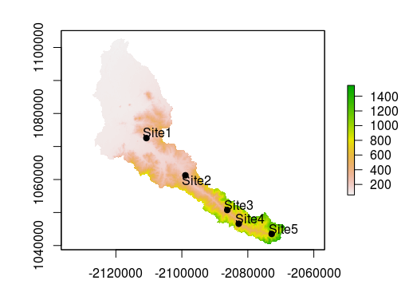
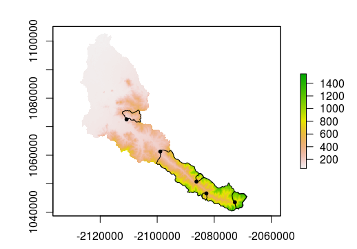

## Extracting Data from Rasters

---

In this section, we'll learn how to pull useful information from raster datasets. These will include generic functions to summarize rasters as a whole or to extract information based on the boundaries of a second layer. 

### Lesson Goals

By the end of this section you will be able to: 
- Read and write raster data from disk and from the web
- Clip raster data
- More...

---

### Excercise 1: Raster and RasterBrick summary stats

We can also extract potentially useful information from a raster layer using several methods.

```r
cellStats(cal_elev, stat='mean')
quantile(cal_elev, probs = c(0.25, 0.5, 0.75))
```
```r
#[1] 300.048
#    25%       50%       75% 
#85.35121 161.22613 408.62559 
```

Many of these methods work with RasterBricks as well (although some of these stats may not be relevant for some of the layers, such as flowdir).

```r
cellStats(cal_terrain, stat='mean')
quantile(cal_terrain, probs = c(0.25, 0.5, 0.75))
```
```r
#        tri         tpi   roughness       slope      aspect     flowdir 
# 9.64157210 -0.09001769 31.13302748  0.12417778  3.29963730 34.03649593 
#                   25%         50%        75%
#tri        0.793477233  5.29052019 15.7185688
#tpi       -1.321671745 -0.10031628  0.9763394
#roughness  2.317155757 17.19726370 50.9859111
#slope      0.007261573  0.06209942  0.2085050
#aspect     1.442969122  3.60642750  5.0135436
#flowdir    4.000000000 16.00000000 64.0000000
```
---

### Excercise 2: Extracting raster data at points

Let's pretend we have 5 sample sites within the Calapooia River basin and we'd like to know the elevation of those sites. In this scenario, we only have the latitude and longitude of each site.

```r
#Read in sample  sites table
sites <- read.csv('./data/calapooia-samples.csv')
#A different flavor of importing coordinates to a spatial object
coordinates(sites) <- c('Lon','Lat') 
proj4string(sites) <- "+proj=longlat +datum=WGS84 
                       +no_defs +ellps=WGS84 +towgs84=0,0,0"
#CRS of points and raster must match
sites <- spTransform(sites, CRS(proj4string(cal_elev)))
#Plot to verify
plot(cal_elev)
plot(sites, add = T, pch = 19)
library(maptools)
pointLabel(coordinates(sites),labels=sites$SampleID)
```



---

We can use `extract` to get elevations at out sample sites. This function returns a vector, so we can simply add the results on as a new column in **sites**.

```r
sites$elevation <- extract(cal_elev, sites)
sites@data
```
```r
#  SampleID elevation
#1    Site1  133.6236
#2    Site2  192.2931
#3    Site3  423.4795
#4    Site4  489.0032
#5    Site5  679.1790
```

### Excercise 3: Extracting data by polygon 

Creating summaries within a polygon is a common and important analysis in GIS, especially in water resources where watershed summaries are often used to understand why freshwater environments differ from one another. Here, we'll walk through an example of delineating watersheds from our points and in **Excercise 2**. We'll then use these watersheds to extract summaries of some of the terrain metrics we calculated for the Calapooia River basin.

To start, we wrote a custion R function that takes advantage of the USGS [StreamStats](https://streamstats.usgs.gov/ss/) online watershed delineation tool. It is worth exploring the point-and-click version. The StreamStat Service API is exposed, meaning  we can build simple text URLs that can be submitted to the server as a query. We won't go into detail for this excercise. First, we need to import the custom function

```r
library(jsonlite);library(sf);library(sp);library(geojsonio)
#Defin function - watershed
watershed = function(state, lon, lat){
  p1 = 'https://streamstats.usgs.gov/streamstatsservices/watershed.geojson?rcode='
  p2 = '&xlocation='
  p3 = '&ylocation='
  p4 = '&crs=4326&includeparameters=false&includeflowtypes=false&includefeatures=true&simplify=true'
  query <-  paste0(p1, state, p2, toString(lon), p3, toString(lat), p4)
  mydata <- fromJSON(query, simplifyVector = FALSE, simplifyDataFrame = FALSE)
  poly_geojsonsting <- toJSON(mydata$featurecollection[[2]]$feature, auto_unbox = TRUE)
  poly <- geojson_sp(poly_geojsonsting)
  poly
}
```

Now that the function is defined, we can read in our table with coordinates and run the function on them, each in turn. Doing so requires a `for` loop in which we select out each point at a time, submit its coordinates to the online service.

```r#Read in the points table
pts <- read.csv('./data/calapooia-samples.csv')
#Loop through each point where each point is a in the table
for(i in 1:nrow(pts)){
  print(i) 
  pt <- pts[i, ] #select row i from table
  #Use info from that row to delin watershed
  wstmp <- watershed(pt$State, pt$Lon, pt$Lat)
  #Make sure they're in the same CRS
  wstmp <- spTransform(wstmp, CRS(proj4string(cal_terrain)))
  #Add a sample ID column to new watershed
  wstmp$SampleID <- pt$SampleID
  #Remove all unnecessary columns
  wstmp <- wstmp[, 'SampleID']
  #Use extract on raster brick
  metrics <- extract(cal_terrain, wstmp, fun = 'mean', na.rm = T, small = T)
  wstmp@data <- cbind(wstmp@data, metrics)
  if(i == 1){
    cal_ws <- wstmp
  }else{
    cal_ws <- rbind(cal_ws, wstmp)
  }
} 
#Plot to see if it worked
plot(cal_elev)
plot(cal_ws, add = T)
plot(sites, add = T, pch=20)
```



---

In addition to delineating the watersheds, the loop used the `extract` function with `fun = mean` to calculate the mean of each of the layers in the RasterBrick **cal_terrain**


