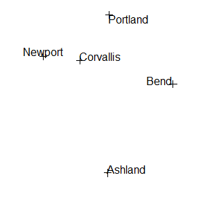
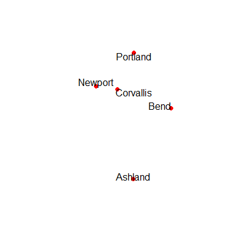
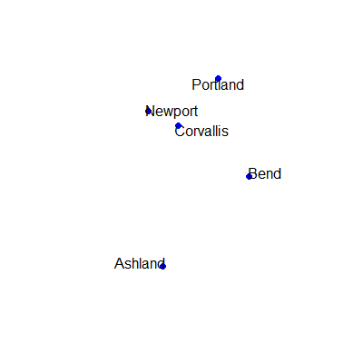
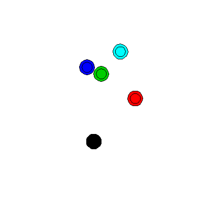
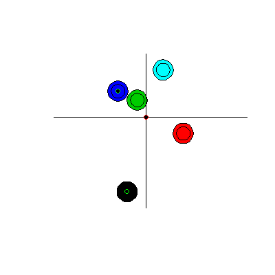

## Spatial Objects I

----

To start, let's consider the simplest vector feature - points. To contain all of the characteristics of a set of points, we need more than just set of latitudes and longitudes. We also need a coordinate reference system, a bounding box, data, and more. The `sp` package bundles all of these things together into a single object called a `SpatialPointsDataFrame`. Think of it as a data frame that is bundled with other features, such as a bounding box, a projection system (proj4string), and coordinates.

---


*Image from: Roger Bivand's book [Applied Spatial Data Analysis in R](http://www.asdar-book.org/)*

---

This type of feature is called an [S4](http://adv-r.had.co.nz/S4.html) object. The structure of S4 objects can be intimidating and a difficult to work with. Perhaps because of this (and other reasons), there has been a big movement towards the newer `sf` package for working with vector data (covered in a subsequent section). However, numerous packages still use the  `sp` object structure, so we need to learn a little bit about them.

---


*[Image from: Colin Gillespie's Twitter feed.](https://twitter.com/csgillespie/status/854438264538845184)*

---

### Lesson Goals

- Import raw coordinates as a spatial object.
- Explore and understand the structure of this object.
- Manipulate the coordinate reference system of objects.
- Explore geospatial operations in R, such as buffering and measuring distance.

### Exploring `sp`

We will take the simple example we used in the previous section and convert it into an `sp` object. We'll print the data frame and the new points object and compare them.

```r
library(sp)
cities <- c('Ashland', 'Corvallis', 'Bend', 'Portland', 'Newport')
population <- c(20062, 50297, 61362, 537557, 9603)
longitude <- c(-122.699, -123.275, -121.313, -122.670, -124.054)
latitude <- c(42.189, 44.57, 44.061, 45.523, 44.652)
coords <- data.frame(longitude, latitude)
dat <- data.frame(cities, population)
pts <- SpatialPointsDataFrame(coords, dat)
print(dat)
print(pts)
```
```r
#     cities population
#1   Ashland      20062
#2 Corvallis      50297
#3      Bend      61362
#4  Portland     537557
#5   Newport       9603

#          coordinates    cities population
# 1 (-122.699, 42.189)   Ashland      20062
# 2  (-123.275, 44.57) Corvallis      50297
# 3 (-121.313, 44.061)      Bend      61362
# 4  (-122.67, 45.523)  Portland     537557
# 5 (-124.054, 44.652)   Newport       9603
```
We can see that **pts** combines the attributes (cities and population) with the latitudes and longitudes and that these make an new combined column called 'coordinates'.

If we do a simple plot of the points and add labels with the `maptools` package, we should be able to confirm that the points are in fact the cities from the previous excercise.

```r
library(maptools)
plot(pts)
pointLabel(coordinates(pts),labels=pts$cities)
```
---



---

So, we can see that the points have coordinates and attributes, but we said that a spatial object needed other features (see figure above). 

Now, do a summary on **pts**

```r 
summary(pts)
```

```r
# Object of class SpatialPointsDataFrame
# Coordinates:
#                min      max
# longitude -124.054 -121.313
# latitude    42.189   45.523
# Is projected: NA 
# proj4string : [NA]
# Number of points: 5
# Data attributes:
#        cities    population    
#  Ashland  :1   Min.   :  9603  
#  Bend     :1   1st Qu.: 20062  
#  Corvallis:1   Median : 50297  
#  Newport  :1   Mean   :135776  
#  Portland :1   3rd Qu.: 61362  
#                Max.   :537557  
```

When we do a summary we can see even more information. In addition to the attributes, we can see the min and max of the coordinates, whether the points are projected (**Is projected: NA**), and more. 

We can see these other attributes, but how do we accesss them? This is where S4 objects will look strange for some users of R that have not encountered them before. 

```r
str(pts)
```

```r
# Formal class 'SpatialPointsDataFrame' [package "sp"] with 5 slots
# ..@ data       :'data.frame':	5 obs. of  2 variables:
# .. ..$ cities    : Factor w/ 5 levels "Ashland","Bend",..: 1 3 2 5 4
# .. ..$ population: num [1:5] 20062 50297 61362 537557 9603
# ..@ coords.nrs : num(0) 
# ..@ coords     : num [1:5, 1:2] -123 -123 -121 -123 -124 ...
# .. ..- attr(*, "dimnames")=List of 2
# .. .. ..$ : NULL
# .. .. ..$ : chr [1:2] "longitude" "latitude"
# ..@ bbox       : num [1:2, 1:2] -124.1 42.2 -121.3 45.5
# .. ..- attr(*, "dimnames")=List of 2
# .. .. ..$ : chr [1:2] "longitude" "latitude"
# .. .. ..$ : chr [1:2] "min" "max"
# ..@ proj4string:Formal class 'CRS' [package "sp"] with 1 slot
# .. .. ..@ projargs: chr NA
```

You will notice the `@` symbol in the output text above. These are called **slots** but for this workshop you don't have to remember that. Let's say that you wanted to get the bounding box of your data. You can use the `@` symbol much like you would the `$` to access particular columns in a data frame.

```r
pts@bbox
```

```r
#                min      max
# longitude -124.054 -121.313
# latitude    42.189   45.523
```

In fact, you can combine the `@` and `$` in the same expression. For example, you can access the data frame (i.e., a slot) and a particular column within the data frame (e.g., population) with:

```r
pts@data$population
```

```r
# [1]  20062  50297  61362 537557   9603
```

Alternatively, there are a number of methods you can use with classes in `sp`.   

```r
coordinates(pts)
```

```r
# longitude latitude
# [1,]  -122.699   42.189
# [2,]  -123.275   44.570
# [3,]  -121.313   44.061
# [4,]  -122.670   45.523
# [5,]  -124.054   44.652
```

---

### Coordinate reference systems

Now that we understand how spatial objects are configured, you may remember there was one last thing that we said was required with spatial data - a coordinate reference system (**CRS**). It is beyond the scope of this workshop to provide a comprehensive review of the various coordinate systems. However, we encourage you do read about and understand some of the common coordinate systems in your study area and how these coordinate systems may affect the way data are presented in your maps. 


*Image from: [https://nceas.github.io/oss-lessons/spatial-data-gis-law/1-mon-spatial-data-intro.html](https://nceas.github.io/oss-lessons/spatial-data-gis-law/1-mon-spatial-data-intro.html)*

---

We can see that our points are likely in degrees. This may not always be the case. It is important to know what projection system you are working with and whether it makes sense for you project. Many GIS operations are easier to conduct if your projection is an equal-area projection with length distance units, such as meters. However, many functions in R can handle degrees. First, it's important to define our current CRS. 

A good resource for finding CRS info to provide to R when tranforming reference systems is http://spatialreference.org/. Another way is to use Google. Let's assume that we know these data were collected with the Norther American Datum 1983 (NAD83). By searching for "proj4string NAD83" we find the spatial reference [page](http://spatialreference.org/ref/epsg/4269/) and if we click on [Proj4](http://spatialreference.org/ref/epsg/4269/proj4/) we can get the string that we should use in R. Let's walk through an example. 

```r
pts@proj4string <- CRS('+proj=longlat +ellps=GRS80 
                        +datum=NAD83 +no_defs')
summary(pts)
```

When we do a summary on **pts** we now see a CRS (proj4string):

```r
# Object of class SpatialPointsDataFrame
# Coordinates:
#   min      max
# longitude -124.054 -121.313
# latitude    42.189   45.523
# Is projected: FALSE 
# proj4string :
#   [+proj=longlat +ellps=GRS80 +datum=NAD83 +no_defs +towgs84=0,0,0]
# Number of points: 5
# Data attributes:
#   cities    population    
# Ashland  :1   Min.   :  9603  
# Bend     :1   1st Qu.: 20062  
# Corvallis:1   Median : 50297  
# Newport  :1   Mean   :135776  
# Portland :1   3rd Qu.: 61362  
# Max.   :537557  
```

We can convert to a different CRS with `spTransform`. Let's conver to the [USGS Albers-Equal Area Conic](http://spatialreference.org/ref/esri/usa-contiguous-albers-equal-area-conic/) projection. R also makes it easy to compare different projections or use the projection of one layer to project another layer. 

- Reproject **pts**.
- Compare CRS of **pts** to **pts2**
- Use the projection of **pts2** to reproject **pts**

```r
pts2 <- spTransform(pts, CRS('+proj=aea +lat_1=29.5 +lat_2=45.5 +lat_0=37.5 
                           +lon_0=-96 +x_0=0 +y_0=0 +ellps=GRS80 
                           +datum=NAD83 +units=m +no_defs '))
proj4string(pts) == proj4string(pts2)
#Returns: FALSE
pts3 <- spTransform(pts, proj4string(pts2))
```

We can compare maps of **pts** (red dots) and **pts2** (blue dots) to see the difference (although difficult to see at this scale). 

  

---

### Excercise 1: Find the nearest cities

Let's say that we want to find the nearest neighboring city to every other city in our data set. We'll use another package called `rgeos`, which has numerous [functions](https://cran.r-project.org/web/packages/rgeos/rgeos.pdf) for doing spatial operations with geospatial data. Here, we will:

- Use the function `rgeos::gDistance` to find the distance of each point to every other point. We will use **pts2** from above because the function returns the distances in the units of the data. 
- Make the diagonal `NA`.
- Applies the `which.min` function on each row to find the location of the shortest distance and adds the results to **pts** as a new column called 'nearest'. 

```r
library(rgeos)
m <- gDistance(pts2, byid=T)
diag(m) <- NA
m <- apply(m, 1, which.min)
pts2$nearest <- pts2$cities[m]
pts2@data
```
```r
#     cities population   nearest
# 1   Ashland      20062      Bend
# 2 Corvallis      50297   Newport
# 3      Bend      61362 Corvallis
# 4  Portland     537557 Corvallis
# 5   Newport       9603 Corvallis
```

---

#### Excercise 2: Place a buffer around each city

Buffers are a commonly used in GIS analyses. Let's place a buffer around each point using `rgeos::gBuffer`. Remember that the units are in meters. 

```r
buff <- gBuffer(pts2, byid = T, width = 30000)
plot(buff, col = buff$cities)
#We can also do negative buffers on polygons
plot(gBuffer(buff, width = -10000), add = T)
```



In this example, we used `byid = T`. If we had not, the polygons would have been a single features with none of the city information associated with them. 

---

#### Excercise 3: It all feels like R

If you are already comfortable working with R, doing GIS in R will feel very familiar. This is a huge benefit. Here are some excercises that should feel familiar

```r
#Select out just one record (Ashland)
ashland <- pts2[pts2$cities == 'Ashland', ]
#Select cities with a population < 50,000
towns <- pts2[pts2$population < 50000, ]
#Add these towns to our plot of buffers
plot(buff, col = buff$cities)
plot(gBuffer(buff, width = -10000), add = T)
plot(towns, add = T, col = 'green', pch = 21)
#Plot horizontal and vertical lines at the mean lat/lon
abline(h = mean(coordinates(pts2)[,2]))
abline(v = mean(coordinates(pts2)[,1]))
#Add a point at the centroid of all the cities
plot(gCentroid(pts2), pch = 21, col='red', add = T)
```



---

### Challenge

We provided a comma-delimited text file called 'StreamGages.csv'. Using what we covered in this section, can you determine how many gages are within 50 km of Portland, OR?

<details> 
  <summary>Approach 1 (click to see answer)</summary>
   <script src="https://gist.github.com/ryan-hill/db60260c510aa720bf1bfa13423f71d7.js"></script>
</details>

---

There's a second approach that uses `sp::over` function, which we didn't cover. 

<details> 
  <summary>Approach 2 (click to see answer)</summary>
   <script src="https://gist.github.com/ryan-hill/120d9ad34a7ab64a13c9c641b2390a93.js"></script>
</details>

---

In the next section, we will learn how to read existing data (e.g., shapefiles) into R with the `rgdal` package. In addition, we will cover some basic manipulations of these data. 
