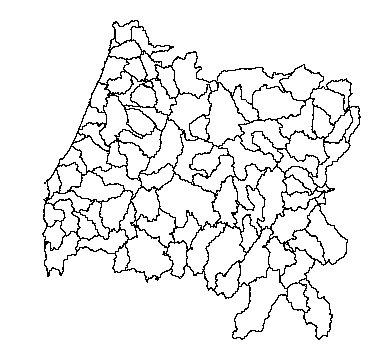
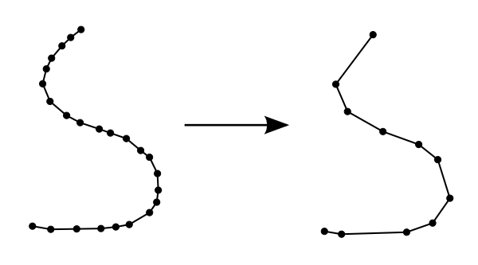
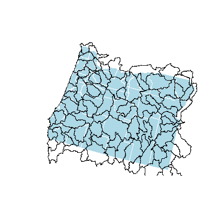
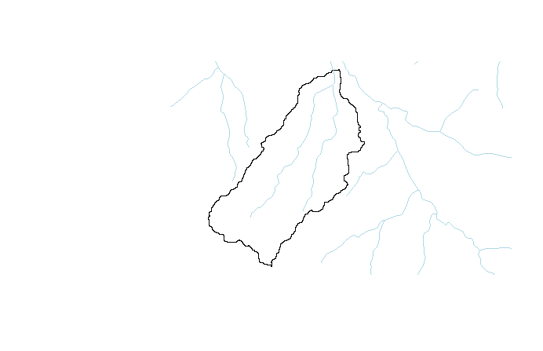

## Spatial Objects II

----

In the previous section, we learned how to create spatial objects in R. In those examples, we focused on importing points from geographic coordinates. However, it is common to bring in external data sets, such ESRI shapefiles. In this section, we will learn how to import and export data from shapefiles. These layers will include polygons and lines and we will wrap up our exploration of geoprocessing examples `sp`-type data, especially with the `rgeos` package. 

By the end of this section you will be able to:

- Read and write shapefiles.
- Simplify spatial layers with complex geometries.
- Calculate geometry metrics such as area of polygons or lengths of lines.
- Clip one vector feature based on a polygon feature.
- Snap points to the nearest line.

### Reading and writing external data

R uses the open source `gdal` C/C++ libraries to read and write vector (and raster) data. This library is extensively used by both open sources and enterprise softwares, including some ESRI applications. The R package for reading and writing spatial data is called `rgdal`. 

First, let's read in a shapefile called 'HUCs.shp'. The code below assumes that you have created an R project and that you have downloaded and extracted these layers to a folder within that project called **'data'**. The function to read in a shapefile is `readOGR` and the syntax to read the layer is may not be intuitive to R users used to reading in data tables. In this fuction:

- dsn = folder where shapefile lives
- layer = name of shapefile (excluding '.shp')
- verbose = rgdal likes to print a lot of stuff while reading in a shapefile - let's tell it to be quiet

```r
library(rgdal)
hucs <- readOGR(dsn = './data', layer = 'HUCs', verbose = F)
plot(hucs)
```



You'll notice that this layer looks suspiciously like a mutant Oregon. These are indeed the 8-digit HUCs this state. 

- What is this layer's CRS?
- What kind of data are included with the layer?

If you look at the shapefile, you'll notice that it is ~12MB on file. This isn't terrible but remember that R reads everything into memory. If we had read all 8-digit HUCs in for the US it may have overwhelmed some computers. Vector data often have far more vertices than is needed for many applications.



*[Image from: https://nceas.github.io/oss-lessons/spatial-data-gis-law/3-mon-intro-gis-in-r.html](https://nceas.github.io/oss-lessons/spatial-data-gis-law/3-mon-intro-gis-in-r.html)*

We will simplify the HUCs layer and write it out to compare how simplification affects the size on disk.

```r
library(rgeos); library(zoom)
# tol=tolerance
hucs_simple <- gSimplify(hucs, tol = 500, topologyPreserve = T)
# gSimplify strips the attribute table and writeOGR will give us an error if we try to write a shapefile without a table. 
hucs_simple <- SpatialPolygonsDataFrame(hucs_simple, data = hucs@data)
writeOGR(hucs_simple, dsn = './data', layer = 'HUCs_simple', driver="ESRI Shapefile")
plot(hucs_simple, border="red", add=T)
zm()
```

The `zoom` package provides a very simple way to navigate around plot windows using the `zm()` method. The keyboard options to navigate are:

- l/r: move left/right
- Up/Down: k/j
- <span>&#43;</span> or i/- or o: zoom in/out
- r: reset view
- q: quit graphics window

We can see from the plot that the simplified geometry is very similar to the original. However, on disk the new shapefile has been reduced to ~1.5MB. 

In addition to shapefiles, it is possible to read geodatabases. For example, if a geodatabase were stored in our **'data'** folder and called 'our_gdb', the code to read in a layer called 'HUCs' within that geodatabase would be as follows:

```r
HUCs <- readOGR(dsn = './data/out_gdb.gdb', layer = 'HUCs', verbose = F)
```

---

### Spatial Operations

We will walk through several examples of spatial operations that are more easier to do now that we can read in shapefiles of data types other than points. Most of these operations are found within the `rgeos` package.   

---

#### Example 1: How many HUC 8s inersect Malheur county? How big are these areas in km<sup>2</sup>? 

First, let's select out Malheur county as it's own object and plot it with the other counties and HUCs to get some context.

```r
counties <- readOGR(dsn = './data', layer = 'counties', verbose = F)
malheur <- counties[counties$NAME == 'Malheur', ]
plot(counties, col = 'lightblue', border = 'white')
plot(malheur, col = 'pink', border = 'transparent', add = T)
plot(hucs_simple, add = T)
```



Now, let's clip the HUCs by Malheur county. To do this, we'll need to use `raster::intersect` because `rgeos::gIntersection` unfortunately does not keep data tables after the intersection has taken place.

```r
library(raster)
malhucs <- intersect(malheur, hucs_simple)
nrow(malhucs)
```
```r
#[1] 16
```

To calculate the areas we'll use `rgeos::gArea`. First, remove most of the columns so it's easier to see the data. Then we'll add the areas.

```r
malhucs <- malhucs[, 'HUC_8']
malhucs$sqkm <- gArea(malhucs, byid = T) / 1e6
malhucs@data
```
```r
#    HUC_8       sqkm
# 1  16040201 1367.20920
# 2  17050103  833.81447
# 3  17050105   22.43079
# 4  17050106  343.75242
# 5  17050107 3112.80129
# 6  17050108 1813.13677
# 7  17050109 3422.59638
# 8  17050110 5117.44578
# 9  17050115  425.85980
# 10 17050116 1781.50753
# 11 17050117 2454.28297
# 12 17050118 1516.54821
# 13 17050119 1933.15554
# 14 17050201  317.69394
# 15 17050202   16.65395
# 16 17120009 1235.12002
```

<br>

#### Example 2: Clipping features (lines and polygons) based on a second feature

We provided you with a shapefile of a sub-basin of the S. Santiam River (ws.shp). We generated this watershed by visiting the USGS's StreamStats [website](https://streamstats.usgs.gov/ss/), navigating to the S. Santiam, and using the watershed delineation tool. Let's use this polygon to clip a set of streams ('south_santiam.shp') and calculate the drainage density (km/km<sup>2</sup>. 

First, let's read in the watershed boundary and stream lines. It's always good to check if layers are in the same projection as well and to make them match if they are different. 

```r
ws <- readOGR(dsn = './data', layer = 'ws', verbose=F)
streams <- readOGR(dsn = './data', layer = 'south_santiam', verbose = F)
proj4string(ws) == proj4string(streams)
#Use ws since it is in an equal area projectiong w/ units==meters
streams <- spTransform(streams, proj4string(ws))
```

To clip the streams, it is possible to use `rgeos::gIntersection` function but this function strips data table from the layer. However, `raster::intersect` can be used to clip vector data and retains the layer attribute information at the same time. Plot the results and see if everything is overlaying correctly.

```r
library(raster)
strclp <- intersect(streams, ws)
plot(ws)
plot(streams, add = T, col='lightblue')
plot(strclp, add = T, col = 'pink', lwd=3)
```



Nice! Now let's look at the stream layer and get the lengths. If we look at the tables of each layer (not shown here), you'll notice that the do have 'Shape_Leng' and 'Shape_Area' columns. They are incorrect and won't work in this case.

```r
strlen <- gLength(strclp, byid=FALSE)
wsarea <- gArea(ws, byid=FALSE)
drn_density <- strlen / wsarea
print(drn_density)
```
```r
[1] 0.0006736335
```

Notice that we used `byid=FALSE`. We could have found the length for each stream segment individually with `byid=TRUE`, but in this example it was convenient for us to get the total length at once. 

We could spend more time exploring operations in 

<br>

#### Example 3: Moving points to the nearest line 

Let's say that you have a colletion of sample sites ('sample1.shp' and 'sample2') and you need to combine them and then snap them to the stream layer. Here's how you can snap the points to the nearest stream line. 

```r
s1 <- readOGR(dsn = './data', layer = 'sample1')
s2 <- readOGR(dsn = './data', layer = 'sample2')
plot(s1, add = T)
plot(s2, add = T, col='red')
```


We can see that, in fact, the sites are slightly away from the stream network. Let's first combine the points and then snap them to the stream network. 

```r
s1 <- s1 + s2 #Yes! 
frac <- gProject(strclp, s1)
snapped <- gInterpolate(strclp, frac)
plot(snapped, pch=20, add = T)
```


---

There are a ton of possible operations that are possible that we could explore. However, many of these operations are also available in the `sf` (simple features) R package. As we noted in the last section, the movement is towards the `sf` package and it will be important to be familiar with it as well. 

