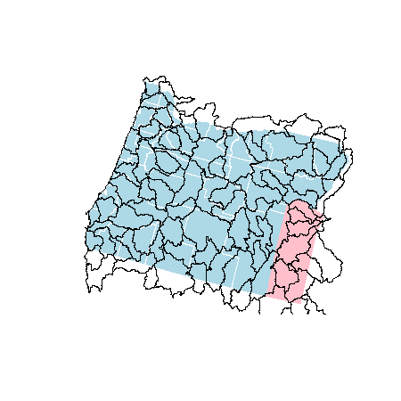

## Spatial Objects II

----

In the previous section, we learned how to create spatial objects in R. In those examples, we focused on importing points from geographic coordinates. However, it is common to bring in data from external data sets, including ESRI shapefiles. In this section, we will learn how to import and export data from shapefiles. These layers will include polygons and lines and we will continue with out exploration of geoprocessing examples with these types of data. 

By the end of this section you will be able to:

- Read and write shapefiles.
- Simplify spatial layers with complex geometries.
- Modify geomoe
- Calculate geometry metrics such as area of polygons or lengths of lines.
- Clip one polygon feature based on another polygon feature.
- Calculate 

### Reading and writing external data

R uses the open source `gdal` C/C++ libraries to read and write vector (and raster) data. This library is extensively used by both open sources and enterprise softwares, including some ESRI applications. The R package for reading and writing spatial data is called `rgdal`. 

First, let's read in a shapefile called 'HUCs.shp'. The code below assumes that you have created an R project and that you have downloaded and extracted these layers to a folder within that project called **'data'**. The function to read in a shapefile is `readOGR` and the syntax to read the layer is may not be intuitive to R users used to reading in data tables. In this fuction:

- dsn = folder where shapefile lives
- layer = name of shapefile (excluding '.shp')
- verbose = rgdal likes to print a lot of stuff while reading in a shapefile - let's tell it to be quiet

```r
library(rgdal)
hucs <- readOGR(dsn = './data', layer = 'HUCs', verbose = F)
plot(hucs)
```


You'll notice that this layer looks suspiciously like a mutant Oregon. These are indeed the 8-digit HUCs this state. 

- What is this layer's CRS?
- What kind of data are included with the layer?

If you look at the shapefile, you'll notice that it is ~12MB on file. This isn't terrible but remember that R reads everything into memory. If we had read all 8-digit HUCs in for the US it may have overwhelmed some computers. Vector data often have far more vertices than is needed for many applications.


*[Image from: https://nceas.github.io/oss-lessons/spatial-data-gis-law/3-mon-intro-gis-in-r.html](https://nceas.github.io/oss-lessons/spatial-data-gis-law/3-mon-intro-gis-in-r.html)*

We will simplify the HUCs layer and write it out to compare how simplification affects the size on disk.

```r
library(rgeos); library(zoom)
# tol=tolerance
hucs_simple <- gSimplify(hucs, tol = 500, topologyPreserve = T)
# gSimplify strips the attribute table and writeOGR will give us an error if we try to write a shapefile without a table. 
hucs_simple <- SpatialPolygonsDataFrame(hucs_simple, data = hucs@data)
writeOGR(hucs_simple, dsn = './data', layer = 'HUCs_simple', driver="ESRI Shapefile")
plot(hucs_simple, border="red", add=T)
zm()
```

The `zoom` package provides a very simple way to navigate around plot windows using the `zm()` method. The keyboard options to navigate are:

- l/r: move left/right
- Up/Down: k/j
- <span>&#43;</span> or i/- or o: zoom in/out
- r: reset view
- q: quit graphics window

We can see from the plot that the simplified geometry is very similar to the original. However, on disk the new shapefile has been reduced to ~1.5MB. 

In addition to shapefiles, it is possible to read geodatabases. For example, if a geodatabase were stored in our **'data'** folder and called 'our_gdb', the code to read in a layer called 'HUCs' within that geodatabase would be as follows:

```r
HUCs <- readOGR(dsn = './data/out_gdb.gdb', layer = 'HUCs', verbose = F)
```

---

### Spatial Operations

We will walk through several examples of spatial operations that are more easier to do now that we can read in shapefiles of data types other than points. Most of these operations are found within the `rgeos` package.   

---

#### Example 1: How many HUC 8s inersect Malheur county? How big are these areas? 

First, let's select out Malheur county as it's own object and plot it with the other counties and HUCs to get some context.

```r
counties <- readOGR(dsn = './data', layer = 'counties', verbose = F)
malheur <- counties[counties$NAME == 'Malheur', ]
plot(counties, col = 'lightblue', border = 'white')
plot(malheur, col = 'pink', border = 'transparent', add = T)
plot(hucs_simple, add = T)
```



Now, let's clip the HUCs by Malheur county. To do this, we'll need to use `raster::intersect` because `rgeos::gIntersection` unfortunately does not keep data tables after the intersection has taken place.

```r
library(raster)
malhucs <- intersect(malheur, hucs_simple)
nrow(malhucs)
```
```r
#[1] 16
```


