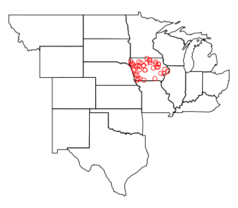

## Simple Features

----

The `sf` Simple Features for R package by Edzer Pebesma is a changes of gears from the `sp` package. The `sf` package provides [simple features access](https://en.wikipedia.org/wiki/Simple_Features) for R. Without a doubt, `sf` will replace `sp` as the fundamental spatial model in R for vector data. Packages are already being updated around `sf`. In addition, it fits in with the "tidy" approach to data of Hadley Wickham's `tidyverse`. The simple feature model will be familiar to folks who use [PostGIS](https://en.wikipedia.org/wiki/PostGIS), [MySQL Spatial Extensions](https://en.wikipedia.org/wiki/MySQL), [Oracle Spatial](https://en.wikipedia.org/wiki/Oracle_Spatial_and_Graph), the [OGR component of the GDAL library](https://en.wikipedia.org/wiki/GDAL), [GeoJSON](https://datatracker.ietf.org/doc/rfc7946/) and [GeoPandas](http://geopandas.org/) in Python.  Simple features are represented with Well-Known text - [WKT](https://en.wikipedia.org/wiki/Well-known_text) - and well-known binary formats.

Important for us today - the `sf` package is fast and pretty simple to use. It can also be more reliable to use than the `sp` package in our experience. All of the functions we have covered so far are also included in `sf` (i.e., it is a very inclusive and ever-expanding package). Finally, you won't lose any of the functionality of `sp` because it is very easy to move data back and forth between `sf` and `sp`. 

#### Equivalent functions

 `sp` + others   | `sf` 
----------------------------------|-------------
sp::bbox()           | st_bbox()   
sp::proj4string()    | st_crs()$proj4string 
sp::coordinates()    | st_coordinates() 
sp::over()           | st_join() 
sp::SpatialPointsDataFrame()  &ensp; | st_as_sf() 
rgdal:: readOGR() | st_read() 
rgdal::writeOGR() | st_write() 
rgeos::gSimplify() | st_simplify() 
rgeos::gArea() | st_area() 
rgeos::gLength() | st_length() 
raster::intersect() | st_intersection() 

Edzar Pebesma has extensive documentation, blog posts and vignettes available for `sf` here:
[Simple Features for R](https://github.com/edzer/sfr).  Additionally, see Edzar's [r-spatial blog](http://r-spatial.org/) which has numerous announcements, discussion pieces and tutorials on spatial work in R focused. 

### Lesson Goals
  - Learn the structure of `sf` objects using some example water sample data
  - Understand plotting with of `sf` objects
  - Use topological operations in `sf` such as spatial intersections, joins and aggregations with example data

---

The best way to introduce the `sf` package and working with simple features may be to dive in with some examples.

#### Excercise 1: Exploring `sf`

To begin, let's look at the methods (specific functions) that are available with `sf`. 

```r
methods(class = "sf")
```
```
##  [1] [                 aggregate         cbind            
##  [4] coerce            initialize        plot             
##  [7] print             rbind             show             
## [10] slotsFromS3       st_agr            st_agr<-         
## [13] st_as_sf          st_bbox           st_boundary      
## [16] st_buffer         st_cast           st_centroid      
## [19] st_convex_hull    st_crs            st_crs<-         
## [22] st_difference     st_drop_zm        st_geometry      
## [25] st_geometry<-     st_intersection   st_is            
## [28] st_linemerge      st_polygonize     st_precision     
## [31] st_segmentize     st_simplify       st_sym_difference
## [34] st_transform      st_triangulate    st_union         
## see '?methods' for accessing help and source code
```

Let's read in a set of point coordinates. For this example, we'll use data from the US EPA's Wadeable Streams Assessment (WSA). 

```r
library(RCurl)
library(sf)

download <- getURL("https://www.epa.gov/sites/production/files/2014-10/wsa_siteinfo_ts_final.csv")
wsa <- read.csv(text = download)
class(wsa)
```
```
## [1] "data.frame"
```

Because this dataframe has coordinate information, we can promotote it to an `sf` spatial object.

```r
wsa = st_as_sf(wsa, coords = c("LON_DD", "LAT_DD"), crs = 4269,agr = "constant")
str(wsa)
plot(wsa$geometry)
```


Notice that in the plot we used `wsa$geometry`. By default, `sf` will create a multi-pane plot, one for each column in the data frame, which can take a long time if you have many columns. However, it can be convenient if you want to plot several columns.

```r
plot(wsa[c(46,56)], graticule = st_crs(wsa), axes=TRUE)
```


Let's subset our feature to just the US plains ecoregions using the 'ECOWSA9' variable in the wsa dataset. Here's an image of the regions in this table: 


*Image from: [https://www.epa.gov/national-aquatic-resource-surveys/nars-ecoregion-descriptions](https://www.epa.gov/national-aquatic-resource-surveys/nars-ecoregion-descriptions)*

---

```r
levels(wsa$ECOWSA9)
wsa_plains <- wsa[wsa$ECOWSA9 %in% c("TPL","NPL","SPL"), ]
plot(wsa_plains$geometry, col='red', add=T)
```


#### Excercise 2. Spatial Subsetting & Intersecting

Now let's grab some administrative boundary data, for instance US states.  After bringing in, let's examine the coordinate system and compare with the coordinate system of the WSA data we already have loaded.  Remember, in `sf`, as with `sp`, we need to have data in the same CRS in order to do any kind of spatial operations involving both datasets.

```r
library(USAboundaries)
states  <- us_states()
levels(as.factor(states$state_abbr))
states <- states[!states$state_abbr %in% c('AK','PR','HI'),]

# Check for equal CRS
st_crs(states) == st_crs(wsa_plains)
```

They're not equal. We'll tranfsorm the WSA sites to same CRS as states.

```r
wsa_plains <- st_transform(wsa_plains, st_crs(states))
```

Now we can plot together in base R.

```r
plot(states$geometry, axes=TRUE)
plot(wsa_plains$geometry, col='blue',add=TRUE)
```


Spatial subsetting is an essential spatial task and it can be performed just like you would subset a table in R.  Say we want to pull out just the states that intersect our 'wsa_plains' sites. 

```r
plains_states <- states[wsa_plains,] #Yes!!!
plot(plains_states$geometry)
```

There are actually several ways to achieve the same thing - here's another:

```r
plains_states <- states[wsa_plains,op = st_intersects]
```

And we can do another attribute subset and then apply a spatial subset yet another way - verify this works for you by plotting results together

```r
iowa = states[states$state_abbr=='IA',]
iowa_sites <- st_intersection(wsa_plains, iowa)
```




