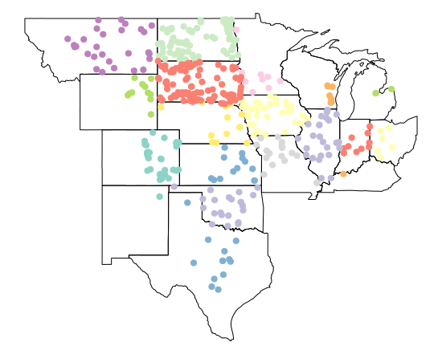

## Simple Features

----

The `sf` Simple Features for R package by Edzer Pebesma is a changes of gears from the `sp` package. The `sf` package provides [simple features access](https://en.wikipedia.org/wiki/Simple_Features) for R and without a doubt, `sf` will replace `sp` as the fundamental spatial model in R for vector data. Packages are already being updated around `sf`. In addition, it fits in with the "tidy" approach to data of Hadley Wickham's `tidyverse`. The simple feature model will be familiar to folks who use [PostGIS](https://en.wikipedia.org/wiki/PostGIS), [MySQL Spatial Extensions](https://en.wikipedia.org/wiki/MySQL), [Oracle Spatial](https://en.wikipedia.org/wiki/Oracle_Spatial_and_Graph), the [OGR component of the GDAL library](https://en.wikipedia.org/wiki/GDAL), [GeoJSON](https://datatracker.ietf.org/doc/rfc7946/) and [GeoPandas](http://geopandas.org/) in Python.  Simple features are represented with Well-Known text - [WKT](https://en.wikipedia.org/wiki/Well-known_text) - and well-known binary formats.

Important for us today - the `sf` package is fast and pretty simple to use. It can also be more reliable to use than the `sp` package in our experience. All of the functions we have covered so far are also included in `sf` (i.e., it is a very inclusive and ever-expanding package). Finally, you won't lose any of the functionality of `sp` because it is very easy to move data back and forth between `sf` and `sp`. 

#### Equivalent functions

 `sp` + others   | `sf` 
----------------------------------|-------------
sp::bbox()           | st_bbox()   
sp::proj4string()    | st_crs()$proj4string 
sp::coordinates()    | st_coordinates() 
sp::over()           | st_join() 
sp::SpatialPointsDataFrame()  &ensp; | st_as_sf() 
rgdal:: readOGR() | st_read() 
rgdal::writeOGR() | st_write() 
rgeos::gSimplify() | st_simplify() 
rgeos::gArea() | st_area() 
rgeos::gLength() | st_length() 
raster::intersect() | st_intersection() 

<br>
Edzar Pebesma has extensive documentation, blog posts and vignettes available for `sf` here:
[Simple Features for R](https://github.com/edzer/sfr).  Additionally, see Edzar's [r-spatial blog](http://r-spatial.org/) which has numerous announcements, discussion pieces and tutorials on spatial work in R focused. 

### Lesson Goals
  - Learn the structure of `sf` objects using some example water sample data
  - Understand plotting with of `sf` objects
  - Use topological operations in `sf` such as spatial intersections, joins and aggregations with example data


The best way to introduce the `sf` package and working with simple features may be to dive in with some examples.

### Excercise 1: Exploring `sf`

To begin, let's look at the methods (specific functions) that are available with `sf`. 

```r
library(sf)
methods(class = "sf")
```
```
##  [1] [                 aggregate         cbind            
##  [4] coerce            initialize        plot             
##  [7] print             rbind             show             
## [10] slotsFromS3       st_agr            st_agr<-         
## [13] st_as_sf          st_bbox           st_boundary      
## [16] st_buffer         st_cast           st_centroid      
## [19] st_convex_hull    st_crs            st_crs<-         
## [22] st_difference     st_drop_zm        st_geometry      
## [25] st_geometry<-     st_intersection   st_is            
## [28] st_linemerge      st_polygonize     st_precision     
## [31] st_segmentize     st_simplify       st_sym_difference
## [34] st_transform      st_triangulate    st_union         
## see '?methods' for accessing help and source code
```

Let's read in a set of point coordinates. For this example, we'll use data from the US EPA's Wadeable Streams Assessment (WSA). 

```r
library(RCurl)

download <- getURL("https://www.epa.gov/sites/production/files/2014-10/wsa_siteinfo_ts_final.csv")
wsa <- read.csv(text = download)
class(wsa)
```
```
## [1] "data.frame"
```

Because this dataframe has coordinate information, we can promotote it to an `sf` spatial object.

```r
wsa <- st_as_sf(wsa, coords = c("LON_DD", "LAT_DD"), crs = 4269,agr = "constant")
str(wsa)
plot(wsa$geometry)
```


Notice that in the plot we used `wsa$geometry`. By default, `sf` will create a multi-pane plot, one for each column in the data frame, which can take a long time if you have many columns. However, it can be convenient if you want to plot several columns.

```r
plot(wsa[c('ECOWSA9','HUC8')], graticule = st_crs(wsa), axes=TRUE)
```


Let's subset our feature to just the US plains ecoregions using the 'ECOWSA9' variable in the wsa dataset. Here's an image of the regions in this table: 


*Image from: [https://www.epa.gov/national-aquatic-resource-surveys/nars-ecoregion-descriptions](https://www.epa.gov/national-aquatic-resource-surveys/nars-ecoregion-descriptions)*

---

```r
levels(wsa$ECOWSA9)
wsa_plains <- wsa[wsa$ECOWSA9 %in% c("TPL","NPL","SPL"), ]
plot(wsa$geometry)
plot(wsa_plains$geometry, col='red', add=T)
```


### Excercise 2: Spatial Subsetting & Intersecting

Now let's grab some administrative boundary data, for instance US states.  After bringing in, let's examine the coordinate system and compare with the coordinate system of the WSA data we already have loaded.  Remember, in `sf`, as with `sp`, we need to have data in the same CRS in order to do any kind of spatial operations involving both datasets.

```r
library(USAboundaries)
states  <- us_states()
levels(as.factor(states$state_abbr))
states <- states[!states$state_abbr %in% c('AK','PR','HI'),]

# Check for equal CRS
st_crs(states) == st_crs(wsa_plains)
```

They're not equal. We'll tranfsorm the WSA sites to same CRS as states.

```r
wsa_plains <- st_transform(wsa_plains, st_crs(states))
```

Now we can plot together in base R.

```r
plot(states$geometry, axes=TRUE)
plot(wsa_plains$geometry, col='blue',add=TRUE)
```


Spatial subsetting is an essential spatial task and it can be performed just like you would subset a table in R.  Say we want to pull out just the states that intersect our 'wsa_plains' sites. 

```r
plains_states <- states[wsa_plains,] #Yes!!!
plot(plains_states$geometry, axes=T)
```

There are actually several ways to achieve the same thing - here's another:

```r
plains_states <- states[wsa_plains,op = st_intersects]
```

### Excercise 3: Joins

Spatial joining in R is an incredibly handy thing and is simple with `st_joins`. Many of us are likely old hands at doing attribute joins of shapefiles with other tabular data in GIS software like ArcGIS or QGis.
By default `st_joins` will perform a left join (return all rows in the left, 'joined to' table regardless of whether there are matches in the right, 'joined' table). `st_joins` also uses st_intersect for the spatial operation.  Note that you can also do an inner join (a match in both tables) as well as use other topological operations for the join such as `st_touches`, `st_disjoint`, `st_equals`, etc.

For this simple example, we'll strip out the state and most other attributes from our WSA sites we've been using, and then use the states `sf` file in a spatial join to get state for each site spatially.  This is a typical task many of us frequently face - assign attribute information from some spatial unit for points within the unit.

So we're asking, in code below, "what state is each WSA site in?", based on where it is located.
```r
# Use column indexing to subset just a couple attribute columns - need to keep geometry column!
wsa_plains <- wsa_plains[c(1:4,60)]
wsa_plains <- st_join(wsa_plains, plains_states)
# verify your results
plot(wsa_plains['state_abbr'], add = T, pch=19)
```



<br>

### Excercise 4: `dplyr` and `sf`

Remember we said one of the advantages of `sf` is that it fits into the `tidyverse` way of operating that streamlines our ability to work with spatial data in R.  One concrete example, which we'll build on in this section, is that we can manipulate and reshape `sf` spatial data directly using `dplyr` and `tidyr` verbs.  

Let's do the same subsetting step above using `dplyr` - for some of you this will be familiar territory, for others it may be confusing - the idea with `dplyr` and 'chained' operations is that it allows you to do more expressive sequences of operations on data in the order you typically think about doing it, rather than created convoluted nested statements in R.

```r
wsa_plains <- wsa %>%
  dplyr::filter(ECOWSA9 %in% c("TPL","NPL","SPL"))
```

The `dply` package has methods to summarize and manipulate data:

* select() keeps only certain variables
* rename() renames a variable and leaves all others unchanged
* filter() returns rows that match a certain condition(s)
* mutate() adds new variables based on existing variables
* transmute() creates new variables and drops existing variables
* arrange() sorts the data frame the by a variable(s)
* slice() selects rows based on row number
* sample_n() samples n features randomly

### Excercise 5: Dissolve

Dissolve is a common task in GIS. Let's dissolve the states boundaries of the US. You can use the `st_union` function to dissolve borders of polygons.

```r
plot(st_union(states))
```


### Excercise 6: Aggregation

Now that we've joined water quality data based on proximity to our WSA sample sites, we can aggregate the results for each WSA site.  

What happened in the previous spatial join step we performed was that we generated a new record for every water quality site within the proximity we gave to our WSA sites - check the number of records in the wsa_iowa data versus the number of records in our join result - we haved repeated records for unique WSA sites.  

So let's aggregate results using dplyr - take a few minutes and see if you can figure out how on your own! The answer is in the SourceCode.R file, but try a bit on your own first, and then if needed run and try to follow the anwer code in SourceCode.R file.


For performing spatial aggregation, the idea is to take some spatial data, and summarize that data in relation to another spatial grouping variable (think city populations averaged by state).  Using some of the data we've used in previous steps, we can accomplish this in a couple of ways.

Let's grab some chemistry data for the WSA sites we've been using so far:

```r
download <- getURL("https://www.epa.gov/sites/production/files/2014-10/waterchemistry.csv")
wsa_chem <- read.csv(text = download)
wsa$COND <- wsa_chem$COND[match(wsa$SITE_ID, wsa_chem$SITE_ID)]
```

Let's join the chemistry data to WSA sites - we're going to summarize the data by states, so let's also plot all the WSA sites with states.

```r
states <- st_transform(states, st_crs(wsa))
plot(states$geometry, axes=TRUE)
plot(wsa$geometry, add=T)
```


Now we'll roll together join and dplyr group-by and summarize to get a conducivity per state object which we'll map using ggplot and geom_sf
```r
avg_cond_state <- st_join(states, wsa) %>%
  dplyr::group_by(name) %>%
  dplyr::summarize(MeanCond = mean(COND, na.rm = TRUE))
plot(avg_cond_state['MeanCond'])
```


<br>
### Challenge

Can you identify states that have centers NE, SE, NW, or SW of the center of the US? Can you dissolve the borders between these groups? 

<details> 
  <summary>Click here to cheat! (click to see answer)</summary>
   <script src="https://gist.github.com/ryan-hill/c7611ce0d6c864542584ccd4974f0305.js"></script>
</details>


